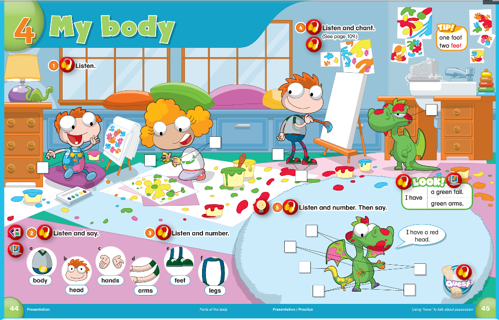

# 课程内容

```bash
Dear all parents：
 我们进入了第四单元的学习，复习了前两单元的语法知识点，新学的单词在家要复习！家长要拍摄孩子在家读新学的单词的视频发群里哈！加油

需要注意 ；
foot 的复数形式是 feet

一只脚 是 a foot
两只脚 是 two feet
```

# 课后作业

- [x] 完成第四单元单词复习视频作业；
- [x] 完成字母书写✍️作业 `I`；
- [x] 完成配音作业[Unit8 My Body](https://children2.qupeiyin.com/index.php?m=home&c=Activity&a=childshare_video&course=MDAwMDAwMDAwMLCdrmeBobKY&uid=MDAwMDAwMDAwMLCHrqyCe76Ur6eacg)

## 复习内容




