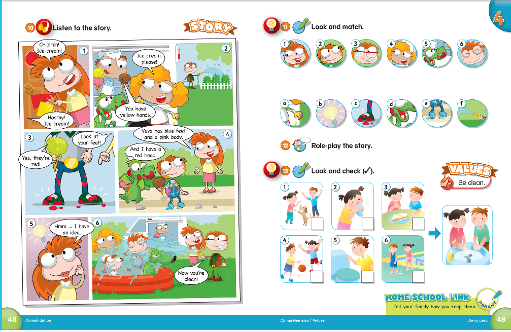
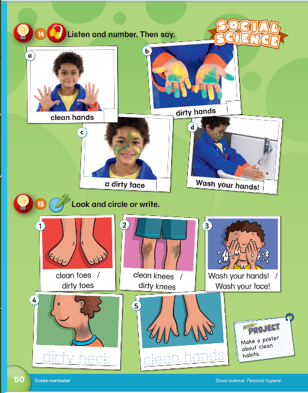
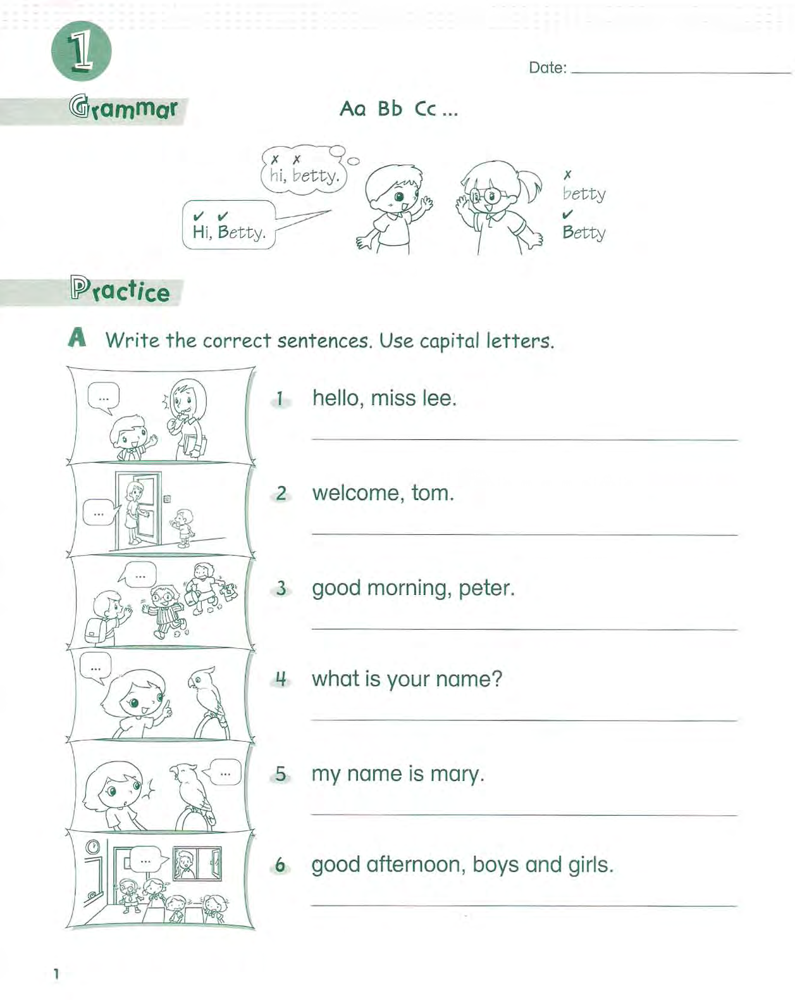
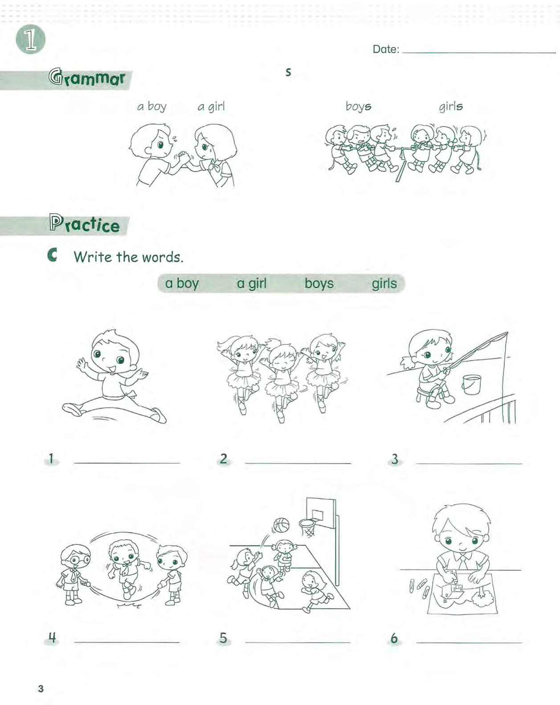

# 课程内容

```bash
Dear all parents：
我们复习了第四单元内容，其中单词 hands 和 neck 的发音需要注意哈！
上次试卷作业我们班完成的不错👍 题目做错的同学，在家要纠正哈！
本期作业；
1-完成试卷练习作业；
2-完成配音作业 ：
【趣学Live】Clean Up
```

# 课后作业

- [x] 完成试卷练习作业
- [x] 拍摄复习视频
- [x] 完成配音作业[趣学Live Clean Up](https://children2.qupeiyin.com/index.php?m=home&c=show&a=share&sharefrom=oneself&id=MDAwMDAwMDAwMLCdxKqCi76Yr6eirA)

## 复习内容






## 试卷内容







