> 2020-02-26 ~ 2020-04-01 

疫情期间宝宝的英语课转成了线上，虽然效果没有现场好，但这种特殊情况下，外教老师倒着时差给孩子上课也不容易～

英语和宝宝一起重新学习哈～ 复习单词，歌曲，对话

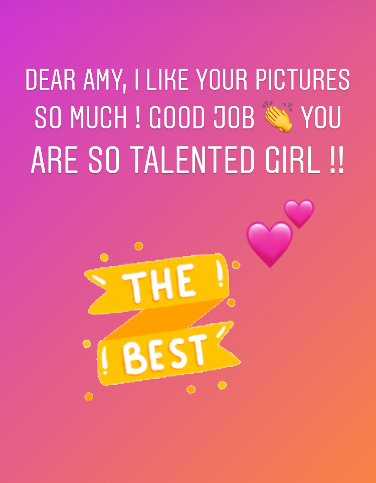
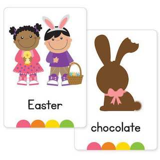
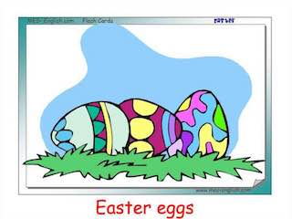
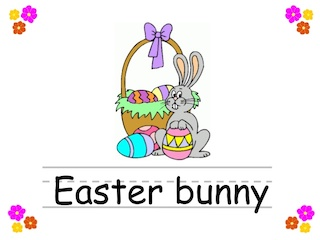
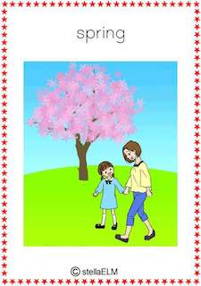
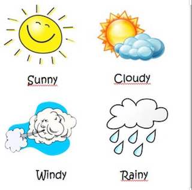
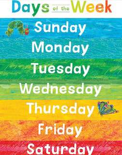
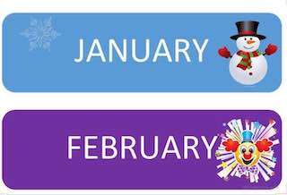
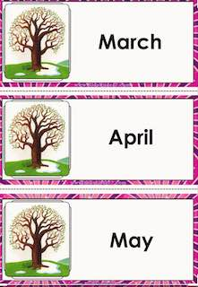
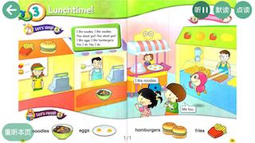
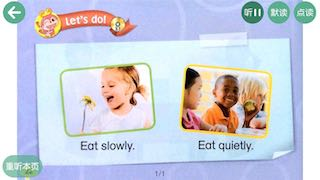
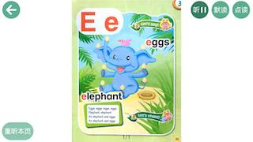
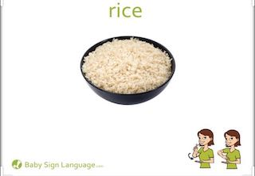
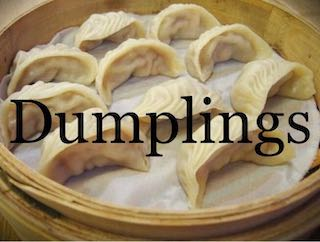
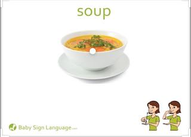
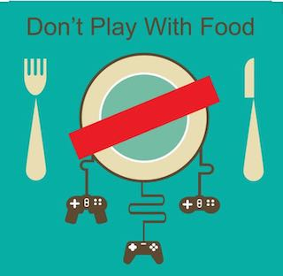
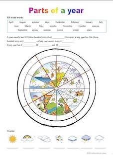

## 复习

### 单词

```
1. Spring ( I like spring )
2. Easter ( I like Easter ) 
3. Easter bunny ( I see Easter bunny ) 
4. Easter eggs ( I see Easter eggs) 
5. Easter chocolate ( I like Easter chocolate ) 
6. Rice 米饭🍚 Dumpling 饺子🥟 Soup 汤🥣
7. Don't play with food
8. a cake , a candle , a balloon ,a party hat
```


### 歌曲

```
Birthday song🎂
How is the weather song ☀️🌸❄️☃️🌧💦
```

### 对话

```
1. Talk
When is your birthday 🎂 ? 
- My Birthday is in ... ( January ,February ,March ...)  
What do you want for your birthday 🎁 ?
- Hello , everybody ! My name is Nataly ! I  am 10 years old . My birthday is in January . I want a red sport  car 🚘 for my birthday 🎂 
Thank you ! 

2. Talk
What’s your favorite season ?
- My favorite season is Spring !
- I like Spring because I can see flowers 💐 
- I like spring because it’s sunny ☀️ 
- I like spring because my Birthday is in March ⭐️

3. Talk
”What do you do in the morning ?”
- I wake up 
- I wash my face 👧👦
- I brush my teeth 😄👅
- I comb my hair 
- I eat breakfast 🥞 🍳 
- I go to school 👫

4. Talk
- Can you see a lion 🦁? 
- Yes, I can ! 
- Can you see a zebra ? 
- No, I can’t 

- What do you like to eat ? 
- I like to eat fries 🍟 and hamburger🍔 
- Do you like rice and noodles 🍝 
- Yes , I do !
- Do you like  pizza 🍕? 
- No , I don’t ! 🤢
 

- How many horses are there  ? 
- There are 2 horses 🐎 🐴 
- How many pigs are there ? 
- There is one pig 🐷 
```

## 画画

```
- When is your Birthday 🎂 ?
- What do you want for your Birthday 🎁 
```


## 2020-02-26

```
Good evening everybody 
Dear kids and parents, thank you all ! The first online English class was very good ! I really enjoy teaching my students 
It is a new type of teaching for me and a new type of learning for kids ,but, I thing , we all doing great 
I am very proud of my students ! ⭐️
Today we have learnt the new topic “ Spring “ 
Please practice at home 📚✅
1.Spring ( I like spring )
2. Easter ( I like Easter ) 
3. Easter bunny ( I see Easter bunny ) 
4. Easter eggs ( I see Easter eggs) 
5.Easter chocolate ( I like Easter chocolate ) 
Also kids can learn the poem “ Easter “ and practice reading 📖 
Feel free to send me your videos 
Thank you all 
```

## 2020-03-04

```
Dear all parents：
 今天我们练习了daily talk 对话部分，复习了 第三单元 并新学了 Rice 米饭🍚 Dumpling 饺子🥟 
Soup 汤🥣
Don't play with food
不要玩食物
在家要复习喔😯
```

## 2020-03-08

```
Good morning , PreK Star ⭐️ 
Thank you all ! We had a great class today 
Today you have a lot of homework , kids 📚 🤓
I know, that I have the smartest students ever and ‘‘this homework will help you to review and practice our daily talk and the new one topic “ Birthday party 🎉 “
Lets learn : 
1.Listen and sing the “ Birthday song “ 
2. Practice please 
-“ When is your Birthday ?” 
-My Birthday is in ... ( January ,February ,March ...) 
p.s. The new one topic will help you to review the topic “ Month of s year “ 
And practice please : 
-What’s your favorite season ?
-My favorite season is Spring !
- I like Spring  because I can see flowers 💐 
- I like spring because it’s sunny ☀️ 
-I like spring because my Birthday is in March ⭐️
You can use these options or create new ones
Also today we have learnt new words : a cake , a candle , a balloon ,a party hat ! 
I would like we add one more sentence -“ make a wish “🙏⭐️
Thank you ones again ! 
Stay healthy  and learn English with EP School 


Dear all parents： 
今天学习了第四单元24-27页。还有月份 June、July、August 、September.
新增对话-
-When is your Birthday ?
-My Birthday is in ... (January /February /March..）

Nataly老师给大家写的内容要看哈，在家要复习喔
```


## 2020-03-10

```
My little star ⭐️ @Amy
Thanks a lot for your dubbing !It is unusually perfect  
I like it so much !! You are a very industrious girl!!
You have improved your pronunciation and it sound very good 
Keep it up ! We are very proud of you 
```


## 2020-03-11

```
Dear all parents：
 今天为止已经把12个月份全部学完了，其中特别是最后4个月份孩子们容易记不住，加强练习哈
今天也复习了第四单元词汇，做了阅读！很长时间没进行阅读了，部分孩子的阅读能力有待提高
当然我们班孩子还是非常不错滴 继续加油


Good job , kids ! 
We had a great class today !! 
You are well-mannered and responsible students !
I like the way we learn 
English It is always good atmosphere and only positive emotions 
Lets Keep it up ! 
Practice the daily talk and do the homework please 📚 
See you all soon 
```

## 2020-03-15

```
Thanks a lot to  the best parents and students  
There was a great class today  
The new daily talk is excellent !! Kids speak very fluent and can give me answers for all my questions like “ When is your birthday 🎂 ?” “ What do you want for your birthday 🎁 ?”
I would like we push harder on reading 💪 
Reading is very important for the young generation 🤓📚
It helps kids get to know sounds , words and language ; 
expand their vocabulary , make a sentence ;
spark your child’s imagination ⭐️
Dear parents ,I would like to say “ Thank you “ to all of you , because of your hard working , practicing and reviewing the homework 📚 with kids ! Only in this way our kids can achieve great results in learning English 
I am really grateful for your help!
We appreciate your trust you have in us that you have selected our school among all for enrolling your child for a better education. We extend our thankful wishes to you and promise that we would work harder for a better development of your child.
Thank you all 
I am very happy being your teacher 👩🏼‍🏫 
```


## 2020-03-18

```
Good job , Prek-Star  !!
Our class was amazing ! 
Thank you all! 
Keep practicing 
We have a new daily talk 
”What do you do in the morning ?”
-I wake up 
-I wash my face 👧👦
-I brush my teeth 😄👅
-I comb my hair 
-I eat breakfast 🥞 🍳 
-I go to school 👫
I think this daily talk is very interesting for kids and it’s also good  to practice speaking 
Dear parents , we learn this daily talk step by step 🤓📚No worries if kids can’t say all these sentences , we will practice it step by step   
Thank you all! 
Take care and stay healthy 

Don’t forget please about reading 📖 
Push it 👍🏻💪
I am very proud of you 
```

## 2020-04-05

```
How is the weather song ☀️🌸❄️☃️🌧💦
Keep practicing 
```

## 2020-03-25

```
Pre-K Star ⭐️ you doing great !! Good job my little ✨ stars !!
Let’s review our grammar !! 
-Can you see a lion 🦁? 
-Yes, I can ! 
- Can you see a zebra ? 
-No, I can’t [傲慢]


-What do you like to eat ? 
- I like to eat fries 🍟 and hamburger🍔 
- Do you like rice and noodles 🍝 
- Yes , I do ![微笑][强]
- Do you like  pizza 🍕? 
- No , I don’t ! 🤢
 

-How many horses are there  ? 
- There are 2 horses 🐎 🐴 
- How many pigs are there ? 
- There is one pig 🐷 

Thank you all !! 
[爱心] 
```


## 2020-03-20 

```
Dear PreK -Star [太阳]
Lets practice the new daily talk together ! 🤓💪📖
What do you do in the morning ? 
- I wake up 
-I brush my teeth 
-I wash my face 
-I comb my hair 
-I eat breakfast 
-I go to school 
加油💪
```

## 2020-03-23

```
👏 Good job, 
my little stars ⭐️ 
You are learning very fast [OK]
Let’s push harder on our new daily talk 💪💪💪🤓📖
I would like, kids,  you make a project 🧐
A poster ( with pictures, drawings , paintings ) and describe what do you do in the morning [太阳][拥抱]
It will be nice 🌸I know how talented and smart you are [爱心]
Deadline: March 31  📆 
Also I would like we make English flexible [拥抱]
I completely agree with the meaning : “ Think over the box “ I would like my students act in this way 🤗
We don’t need to be concentrated on one sentence or word that we learnt , we can create new ones too [微笑]
Let’s be creators🙌🏼
For example we know the verb 
“ wash”
We know nouns 
-a head 
-hands 
-an apple 🍎 
-etc ...( a lot of nouns from previous topics ) 
And we can make new sentences , like :
-I wash my face in the morning [太阳]
-Please , wash an apple 🍏 
-I wash and comb  my head .
-Wash your hands before you eat [OK]
Thank you all ! 
You are  great 👍🏻 mhard workers !!
Keep it up [太阳][爱心]
```

## 2020-04-01 

```
Good job , kids 
You doing great !! 
Please review at home two topics : “ Birthday party 🎉 “ and “Good  habits “
Also I would like you make a presentation “ What do you want for your birthday 🎁? “
Example : 
Hello , everybody ! My name is Nataly ! I  am 10 years old . My birthday is in January . I want a red sport  car 🚘 for my birthday 🎂 
Thank you ! 
Don’t make it complicated 🙌🏼just practice the daily talk [太阳]
@Avery爸爸 @Amy(小慈)爸爸 @Michael（颜子灏）爸爸 @Zachary(张攸宸)妈妈 
You can draw a picture and describe it [偷笑]
The main point is to practice :
- When is your Birthday 🎂 ?
- What do you want for your Birthday 🎁 
Thank you 🙏 
Take care [玫瑰][KeepFighting][爱心]
```


