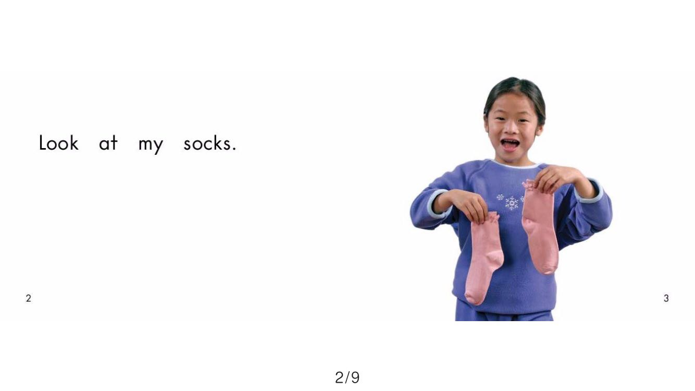
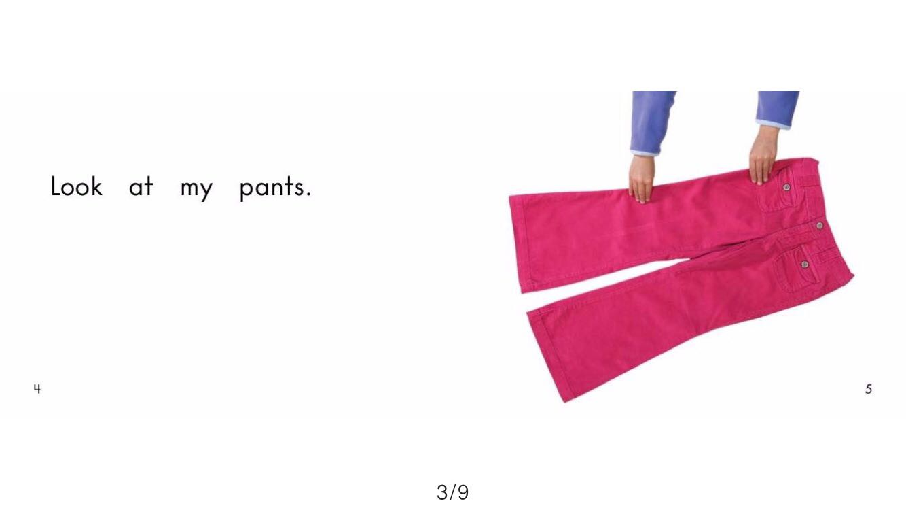
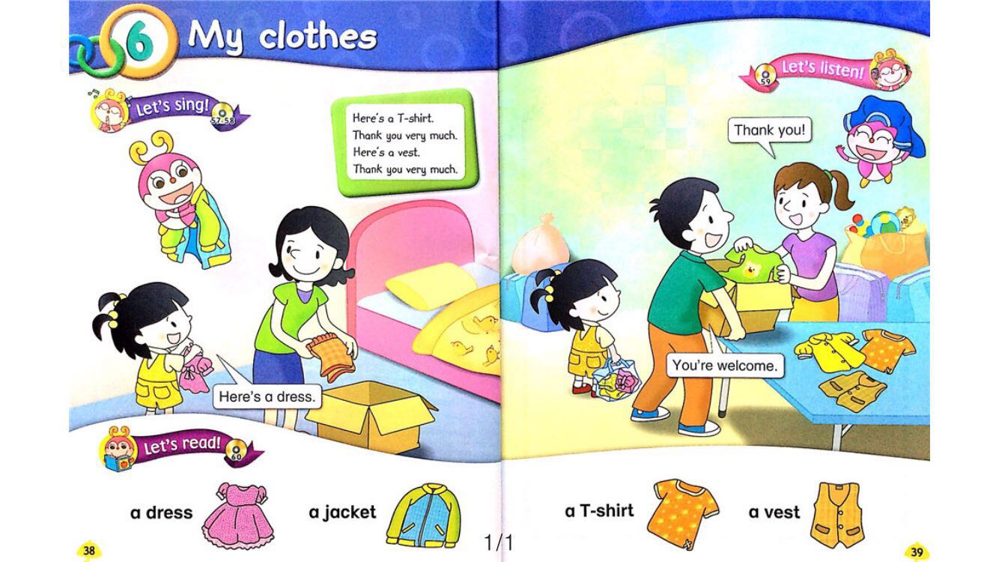
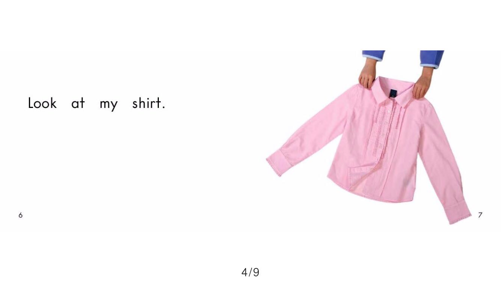
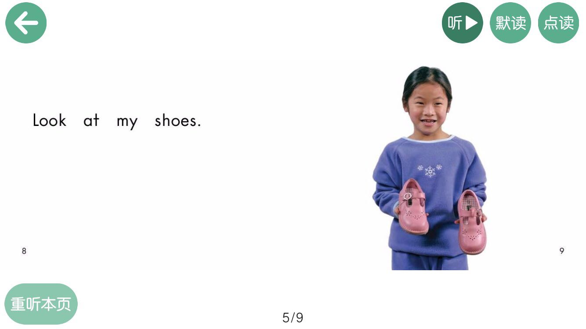

> 2020-04-09 ~ 2020-04-11 

## 作业
上周老师布置的作业，Amy非常努力地练习，虽然还是很害羞哈。

<iframe height=498 width=510 src='https://player.youku.com/embed/XNDYyOTM5NjkzNg==' frameborder=0 'allowfullscreen'></iframe>

<iframe height=498 width=510 src='https://player.youku.com/embed/XNDYyOTQyNDE0OA==' frameborder=0 'allowfullscreen'></iframe>


```
小渔🐟。 2020/04/11 19:59:16
通过游戏来复习英语  棒棒哒

Nataly🦄  2020/04/11 20:08:01
@Amy(小慈)爸爸 it’s very fun , guys 😄!! I like it 😄 
Good job , parents ! Great job, Amy ! 
Parents , you are a good example for Amy !  
One of the best ways to learn English, is to learn English in fun and natural environment
```


## 歌曲

```
Nataly🦄
Here are wonderful songs for kids ! Let’s review our topics “ Days of the week “ “ Month of the Year “ 
```

### Month of the Year

<iframe height=498 width=510 src='https://player.youku.com/embed/XNDYyOTM5ODM3Mg==' frameborder=0 'allowfullscreen'></iframe>


### Days of the week

<iframe height=498 width=510 src='https://player.youku.com/embed/XMTc2NzQ1OTgyOA==' frameborder=0 'allowfullscreen'></iframe>

### Wake up

<iframe height=498 width=510 src='https://player.youku.com/embed/XNDYyOTM5ODcyOA==' frameborder=0 'allowfullscreen'></iframe>

### my clothes

<iframe height=498 width=510 src='https://player.youku.com/embed/XNDYyOTM5ODEyOA==' frameborder=0 'allowfullscreen'></iframe>


## 新课程2020-04-09

```
Dear all parents：
昨晚我们上了第六单元38-39页，练习了以前学习过的对话，并做了一些阅读 在家要复习哈！Nataly老师把我们上课用到的歌曲视频都发到群里啦，在家可以放给孩子们听哈 
```









