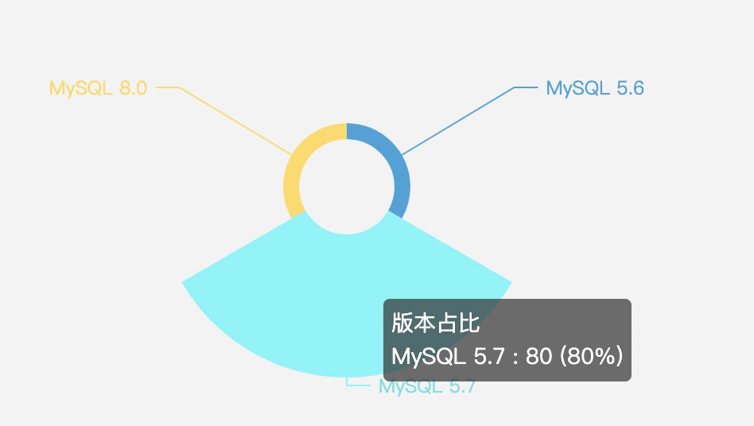

# 说在前面

- 2016年第一次接触 MySQL，版本是 MariaDB 5.5

- 2017年生产上接触 MySQL 5.6 和 MariaDB 10.0

- 2018年开始生产上接触 MySQL 5.7

- 2019年开始生产上接触 MySQL 8.0

由于2017年~ 2020年在乙方公司，因此接触的MySQL体量非常大，统计过维护的数据库版本占比：

- 5.6 10%
- 5.7 80%
- 8.0 10%

从2020年下半年开始 8.0 的生产使用占比逐步增加。

MySQL数据库软件正在不断开发中，并且参考手册也经常更新。作为DBA也要与时俱进，掌握最新的技术。

MySQL8.0的帮助手册的最新版本可从<https://dev.mysql.com/doc/在线以可搜索的形式获得> 。那里也有其他格式，包括可下载的HTML和PDF版本。

MySQL本身的源代码包含使用Doxygen编写的内部文档。生成的Doxygen内容可从 [https://dev.mysql.com/doc/index-other.html获得](https://dev.mysql.com/doc/index-other.html)。使用[第2.9.10节"生成MySQL Doxygen文档内容"中](https://dev.mysql.com/doc/refman/8.0/en/source-installation-doxygen.html)的说明，还可以从MySQL源分发本地生成此内容 。

如果您对使用MySQL有疑问，请加入 [MySQL Community Slack](https://mysqlcommunity.slack.com/)或在我们的论坛中提问；请参见[MySQL论坛上的MySQL社区支持](https://dev.mysql.com/doc/refman/8.0/en/information-sources.html#forums)。如果您对手册本身有补充或更正的建议，请发送至 <http://www.mysql.com/company/contact/>。

# 学习笔记

根据官方帮助手册，在此记录自己的学习笔记。

- [MySQL 8.0 安全部署指南](/api/mysql_8.0_reference_manual/01-MySQL-Secure-Deployment-Guide/index.html)
- [MySQL 8.0 启动和关闭](/api/mysql_8.0_reference_manual/02-Starting-and-Stopping-MySQL/index.html)
- [MySQL 8.0 基础入门](/api/mysql_8.0_reference_manual/03-MySQL-Tutorial/index.html)
- [MySQL 8.0 全球化](/api/mysql_8.0_reference_manual/04-MySQL-Globalization/index.html)
- [MySQL 8.0 限制和局限](/api/mysql_8.0_reference_manual/05-MySQL-Restrictions-and-Limitations/index.html)
- [MySQL 8.0 分区](/api/mysql_8.0_reference_manual/06-MySQL-Partitioning/index.html)
- [MySQL 8.0 备份和恢复](/api/mysql_8.0_reference_manual/07-MySQL-Backup-and-Recovery/index.html)
- [MySQL 8.0 Information Schema](/api/mysql_8.0_reference_manual/08-MySQL-Information-Schema/index.html)
- [MySQL 8.0 Performance Schema](/api/mysql_8.0_reference_manual/09-MySQL-Performance-Schema/index.html)
- [MySQL 8.0 SYS Schema](/api/mysql_8.0_reference_manual/10-MySQL-SYS-Schema/index.html)
- [MySQL 8.0 复制](/api/mysql_8.0_reference_manual/11-MySQL-Replication/index.html)
- [MySQL 8.0 组复制 MGR](/api/mysql_8.0_reference_manual/12-MySQL-Group-Replication/index.html)
- [MySQL 8.0 Shell](/api/mysql_8.0_reference_manual/13-MySQL-Shell/index.html)
- [MySQL 8.0 InnoDB Storage Engine](/api/mysql_8.0_reference_manual/14-MySQL-InnoDB-Storage-Engine/index.html)
- [MySQL 8.0 优化](/api/mysql_8.0_reference_manual/15-MySQL-Optimization/index.html)
- [MySQL 8.0 其他](/api/mysql_8.0_reference_manual/00-others/index.html)
- [MySQL Utilities](/api/mysql_8.0_reference_manual/16-MySQL-Utilities/index.html)
