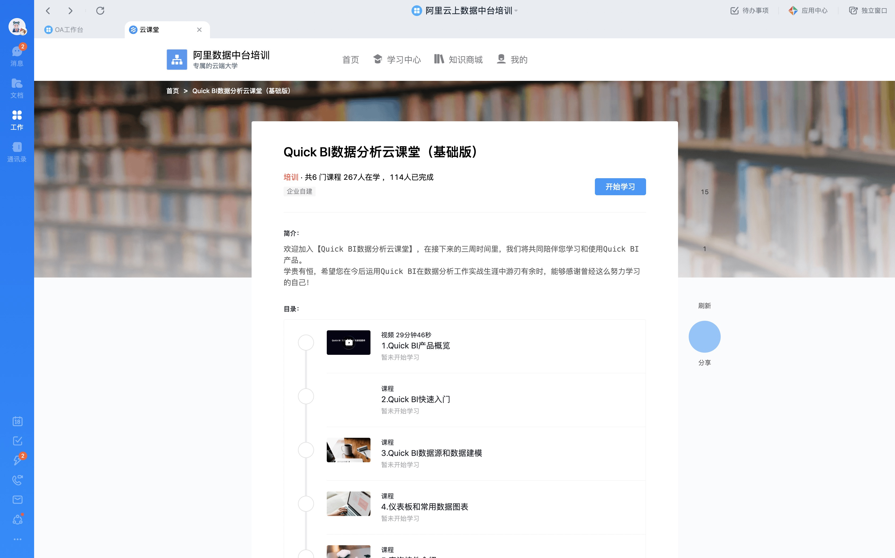

## 简介

欢迎加入【Quick BI数据分析云课堂】，在接下来的三周时间里，我们将共同陪伴您学习和使用Quick BI产品。
学贵有恒，希望您在今后运用Quick BI在数据分析工作实战生涯中游刃有余时，能够感谢曾经这么努力学习的自己！

### 目录

1. Quick BI产品概览

2. Quick BI快速入门

3. Quick BI数据源和数据建模

4. 仪表板和常用数据图表

5. 查询控件介绍

6. OLAP多维快速计算分析分享

## 学习方式

在线钉钉学习

