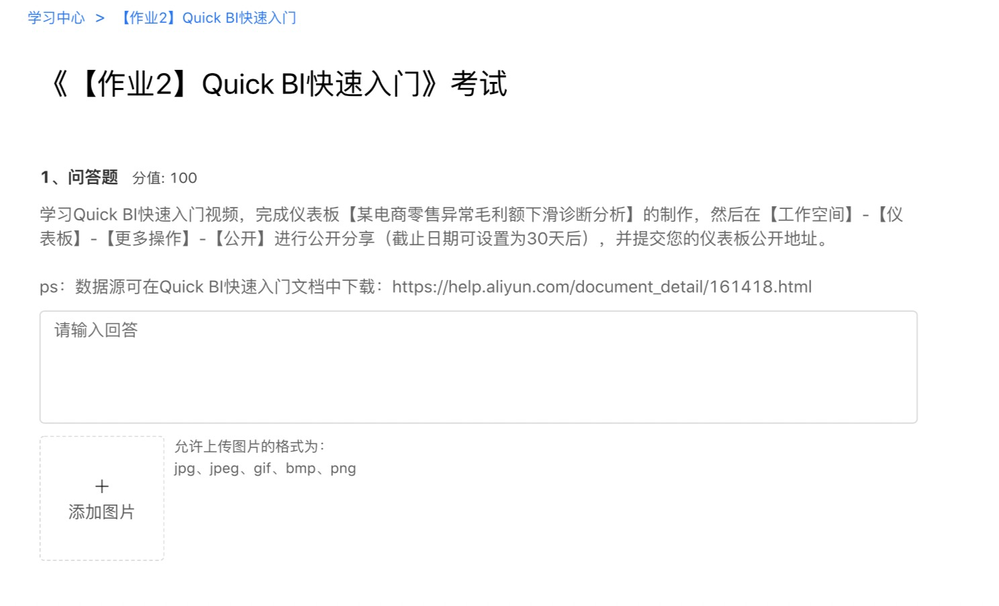
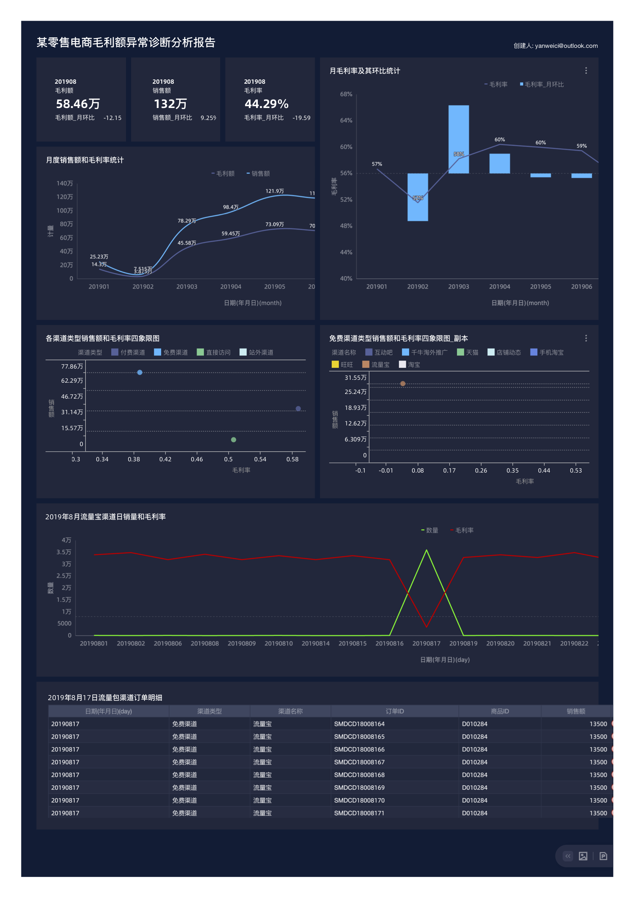

## 课程列表

* 业务背景介绍&快速连接数据源
* 创建数据集和数据建模
* 销售额和毛利额月度趋势分析
* 各流量渠道毛利率探索分析
* 异常流量渠道订单明细诊断

## 考试




[帮助文档](https://help.aliyun.com/document_detail/161418.html)


1. 2019年8月份企业月环比毛利率下跌了20%——定位到毛利率异常的月份
2. 通过四象限图定位到是"免费渠道"的毛利率最低——定位到该月份具体哪种类型的渠道的毛利率低
3. 通过四象限图继续定位到是"免费渠道"中的"流量宝"毛利率最低——定位到具体哪个渠道名称
4. 通过对流量宝渠道日销量和毛利率图定位到是"2019年8月17日"毛利率异常——定位到该渠道具体哪天异常
5. 通过2019年8月17日流量包渠道订单明细表定位到异常的订单

