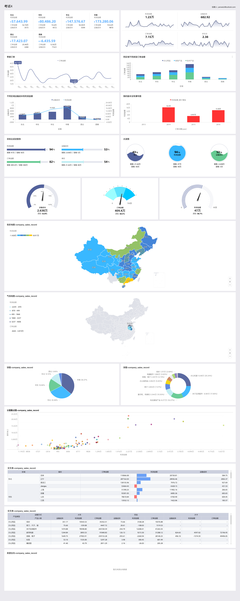
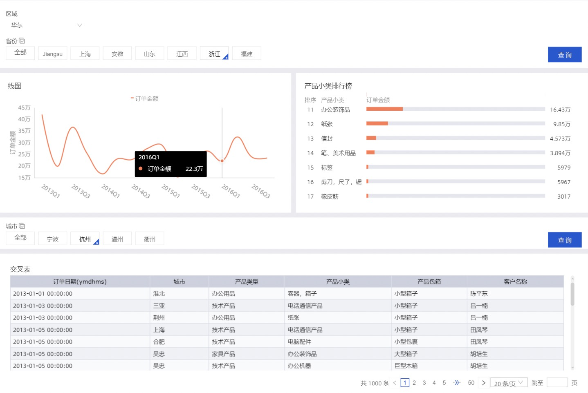

## 课程列表

本章节将为您介绍仪表板的基本概念，包括仪表板中数据图表的类型、使用场景和组成图表的数据要素。

仪表板采用了灵活的磁贴式布局来显示报表数据的交互，它不仅可以将数据以可视化的方式呈现，还支持通过各种数据筛选和查询，使用各种数据展现方式，突出数据中的关键字段。

从数据的展示层面看，仪表板通过引导，拖拽，双击字段，让数据展示得更加直观明了；从数据的分析层面看，通过友好的提示，提升用户的交互体验。

数据在展示性能上也有了更大的提升，在仪表板的编辑页面就可以实现动态数据的查询。

[指标拆解树](https://help.aliyun.com/document_detail/163227.html?spm=a2c4g.11186623.6.683.7172a0db9uBk17)

## 仪表板制作整体流程

仪表板制作从新建仪表板开始，仪表板区域的整个操作请参见[仪表板操作](https://help.aliyun.com/document_detail/53448.html#concept-s3q-1by-5db)。

以可视化图表为中心，你可以实现条件过滤，优化界面布局和展示方式，同时可进行钻取、联动、分析预警等多种可视化分析操作。请参见[查询控件](https://help.aliyun.com/document_detail/149968.html#concept-2385732)和[其他控件](https://help.aliyun.com/document_detail/126638.html#concept-1322754)。

## 仪表板制作步骤

1. [仪表板操作](https://help.aliyun.com/document_detail/53448.html#concept-s3q-1by-5db)
2. [可视化图表](https://help.aliyun.com/document_detail/53072.html#concept-x2d-lsy-5db)
3. [可视化分析](https://help.aliyun.com/document_detail/90045.html#concept-arc-kmb-bfb)
4. [查询控件](https://help.aliyun.com/document_detail/149968.html#concept-2385732)
5. [其他控件](https://help.aliyun.com/document_detail/126638.html#concept-1322754)

## 可视化图表

不同的数据需要不同的图表类型来展示，目前Quick BI支持40余种数据图表，包括线图、柱图、气泡地图、漏斗图等。

下表提供了各个图表的分析类型及其常见的使用场景。

| 分析类型 | 说明                                                         | 场景举例                                                     | 可用图表                                                     |
| :------- | :----------------------------------------------------------- | :----------------------------------------------------------- | :----------------------------------------------------------- |
| 比较     | 对比各个值之间的差别，或者需要显示对度量按类别区分的简单比较。 | 比较不同国家或地区的销售/收入差别。                          | 柱图，组合图，条形图，雷达图，漏斗图，交叉表，透视表，极坐标图，旋风漏斗，词云图 |
| 百分比   | 显示某个部分占整体的百分比，或某个值相对于整体的比例。       | 显示哪位销售人员的销售额，在总销售额中所占的比率最大。       | 饼图，漏斗图，仪表盘，矩阵树图                               |
| 相关     | 显示各个值之间的关系，或比较多个度量值。                     | 可以查看两个度量之间的相关性，了解第一个度量对第二个度量的影响。 | 散点图，矩阵树图，指标看板，树图，来源去向，进度条           |
| 趋势     | 显示数据值的趋势（尤其是基于时间变化的趋，例如年/月/日）；或数据指标进展以及可能具有的模式。 | 可以查看某一个产品在一定时间范围内的销售或收入趋势。         | 线图，面积图                                                 |
| 地理图   | 在地图上直观显示国家或地区的相关数据指标大小和分布范围。使用的数据集必需包含地理数据。 | 可以查看某一个国家，各个地区的收入情况。                     | 气泡地图，色彩地图，LBS地图                                  |


- 数据标签页决定了图表展示的数据内容。
- 样式标签页决定了图表的外观和所要显示的细节。
- 高级标签页决定了数据和多个图表之间是否能形成联动，并根据您的需求动态展示数据之间的互动和对比。


每一个图表都配有数据，样式和高级三个标签页，如下图所示。

每一个图表之所以能区分其它的图表而单独存在，其原因就在于核心数据要素与其它图表不同，例如地图图表，核心的数据要素就是必须有一个地理纬度，否则无法在地图上展示数据。

下表展示了各个图表所需要的核心数据要素。

| 图表名称         | 图表数据要素                                            | 数据要素构成                                                 | 使用场景                                                     |
| :--------------- | :------------------------------------------------------ | :----------------------------------------------------------- | :----------------------------------------------------------- |
| 线图             | 类别轴，值轴                                            | 类别轴上最少1个维度；值轴上最少1个度量                       | [线图](https://help.aliyun.com/document_detail/55053.html#concept-mrr-y1z-5db)可用来展示在相等的时间间隔下数据的趋势走向。 |
| 面积图           | 类别轴，值轴                                            | 类别轴上最少1个维度；值轴上最少1个度量                       | 与[线图](https://help.aliyun.com/document_detail/55053.html#concept-mrr-y1z-5db)类似，[面积图](https://help.aliyun.com/document_detail/68315.html#concept-rvx-tyd-vdb)可用来展示在一定时间内数据的趋势走向以及它们所占的面积比例。 |
| 堆积面积图       | 类别轴，值轴                                            | 类别轴上最少1个维度；值轴上最少1个度量                       | 堆积面积图和基本[面积图](https://help.aliyun.com/document_detail/68315.html#concept-rvx-tyd-vdb)一样，唯一的区别就是图上每一个数据集的起点不同，起点是基于前一个数据集的，用于显示每个数值所占大小随时间或类别变化的趋势线，展示的是部分与整体的关系。 |
| 百分比堆叠面积图 | 类别轴，值轴                                            | 类别轴上最少1个维度；值轴上最少1个度量                       | 在层叠面积图的基础之上，将各个面积的因变量的数据使用加和后的总量进行归一化就形成了百分比堆叠面积图。 |
| 柱图             | 类别轴，值轴                                            | 类别轴上最少1个维度；值轴上最少1个度量                       | [柱图](https://help.aliyun.com/document_detail/55596.html#concept-bnq-fd2-vdb)可用来比较各组数据之间的差别，并且可以显示一段时间内的数据变化情况。 |
| 堆积柱状图       | 类别轴，值轴                                            | 类别轴上最少1个维度；值轴上最少1个度量                       | 堆积柱状图可以形象地展示一个大分类包含的每个小分类的数据，以及各个小分类的占比，显示单个项目与整体之间的关系。 |
| 百分比堆积柱状图 | 类别轴，值轴                                            | 类别轴上最少1个维度；值轴上最少1个度量                       | 柱子的各个层代表的是该类别数据占该分组总体数据的百分比。用于形象地展示一个大分类包含的每个小分类的数据，以及各个小分类的占比，显示单个项目与整体之间的关系。 |
| 环形柱状图       | 类别轴，值轴                                            | 类别轴上最少1个维度；值轴上最少1个度量                       | 环形柱状图可用来比较各组数据之间的差别，并且可以显示一段时间内的数据变化情况。 |
| 组合图           | 类别轴，值轴                                            | 类别轴上最少1个维度；主值轴和副值轴上最少1个度量             | [组合图](https://help.aliyun.com/document_detail/113901.html#concept-z1t-gsn-jhb)支持双轴展示不同量级数据，并在单边下支持常规线图柱图面积图组合、堆积混合、百分比堆积的复杂场景展示。 |
| 条形图           | 类别轴，值轴                                            | 类别轴上最少1个维度；值轴上最少1个度量                       | 与[柱图](https://help.aliyun.com/document_detail/55596.html#concept-bnq-fd2-vdb)类似，[条形图](https://help.aliyun.com/document_detail/68320.html#concept-zm3-422-vdb)用横向的展示方式来比较数据之间的大小以及各项之间的差距。 |
| 堆积条形图       | 类别轴，值轴                                            | 类别轴上最少1个维度；值轴上最少1个度量                       | 将每根条进行分割以显示相同类型下各个数据的大小情况。可以形象地展示一个大分类包含的每个小分类的数据，以及各个小分类的对比，显示的是单个项目与整体之间的关系。 |
| 百分比堆积条形图 | 类别轴，值轴                                            | 类别轴上最少1个维度；值轴上最少1个度量                       | 条形图的各个层代表的是该类别数据占该分组总体数据的百分比。用于形象地展示一个大分类包含的每个小分类的数据，以及各个小分类的占比，显示的是单个项目与整体之间的关系。 |
| 饼图             | 扇区标签，扇区角度                                      | 扇区标签上有且仅有1个维度，并且维度值小于等于12；扇区角度上有且仅有1个度量 | [饼图](https://help.aliyun.com/document_detail/55621.html#concept-gwq-4f2-vdb)可用来展示数据中各项的大小与各项总和的比例。 |
| 气泡地图         | 地理区域，气泡大小                                      | 地理区域有且仅有1个维度，并且为地理纬度；气泡大小有最少1个最多5个度量 | [气泡地图](https://help.aliyun.com/document_detail/55644.html#concept-zrl-kk2-vdb)可以直观地显示国家或地区的相关数据指标大小和分布范围。 |
| 色彩地图         | 地理区域，色彩饱和度                                    | 地理区域有且仅有1个维度，并且为地理纬度；色彩饱和度最少1个最多5个度量 | [色彩地图](https://help.aliyun.com/document_detail/55653.html#concept-vsg-jl2-vdb)用色彩的深浅来展示数据的大小和分布范围。 |
| LBS气泡地图      | 地理区域，LBS气泡大小                                   | 地理区域有且仅有1个维度，并且为地理纬度；LBS气泡大小有且只有1个度量 | [LBS气泡地图](https://help.aliyun.com/document_detail/71909.html#concept-glz-t4f-vdb)以一个地图轮廓为背景，用附着在地图上面的气泡来反映数据的大小。 |
| LBS热力地图      | 地理区域，LBS热力深度                                   | 地理区域有且仅有1个维度，并且为地理纬度；LBS热力深度最少1个最多5个度量 | [LBS热力地图](https://help.aliyun.com/document_detail/71925.html#concept-brr-dnf-vdb)用热力的深浅来展示数据的大小和分布范围。 |
| LBS飞线地图      | 地理区域/经纬度(from)，地理区域/经纬度(to)，LBS飞线度量 | 地理区域最多只能取2个维度，且必须为地理信息；LBS飞线度量最少1个最多5个度量 | [LBS飞线地图](https://help.aliyun.com/document_detail/85229.html#concept-pgm-jpv-k2b)以一个地图轮廓为背景，用动态的飞线反映两地或者多地之间的数据大小。而且还可以直观地显示国家或地区的相关数据指标大小和分布范围。 |
| 交叉表           | 行和列                                                  | 行对维度无限制；列对度量无限制                               | [交叉表](https://help.aliyun.com/document_detail/55666.html#concept-wc5-zl2-vdb)以工作表的样式，来显示表中某个字段的汇总值，例如求和、平均值、记数、最大值、最小值等。 |
| 仪表盘           | 指针角度                                                | 有且仅有1个度量                                              | [仪表盘](https://help.aliyun.com/document_detail/55668.html#concept-mmt-3n2-vdb)可清晰地展示出某个指标值所在的范围。 |
| 雷达图           | 分支标签，分支长度                                      | 分支标签最少1个最多2个维度，分支长度最少1个度量              | [雷达图](https://help.aliyun.com/document_detail/55675.html#concept-xkk-b42-vdb)可用来展示分析所得的数字或比率。 |
| 散点图           | 颜色图例，X轴，Y轴                                      | 颜色图例有且仅有1个维度，并且维度成员的数值可达1000；X轴：最少1个最多3个度量；Y轴： 有且仅有1个度量 | [散点图](https://help.aliyun.com/document_detail/55680.html#concept-w3v-cp2-vdb)可以用来展示数据的相关性和分布关系。 |
| 气泡图           | X轴，Y轴，气泡大小                                      | 维度成员的数值可达1000；X 轴：最少1个维度；Y 轴： 有且仅有1个度量；气泡大小有且仅有一个度量 | [气泡图](https://help.aliyun.com/document_detail/118641.html#concept-265020)可以用位置和气泡大小展示数据的分布和聚合情况。 |
| 漏斗图           | 漏斗层标签，漏斗层宽                                    | 漏斗层标签有且仅有1个维度；漏斗层宽有且仅有1个度量           | [漏斗图](https://help.aliyun.com/document_detail/55682.html#concept-u3s-1q2-vdb)可用来展示业务各环节的转化递进情况。 |
| 指标看板         | 看板标签，看板指标                                      | 看板标签最多1个维度；看板指标最少1个，最多10个度量           | [指标看板](https://help.aliyun.com/document_detail/55685.html#concept-k5j-cr2-vdb)可用来展示数据在每一个阶段的变化情况。 |
| 矩阵树图         | 色块标签，色块大小                                      | 色块标签有且仅有1个维度；色块大小有且仅有1个度量             | [矩阵树图](https://help.aliyun.com/document_detail/55690.html#concept-q2y-4gf-vdb)可用来描述考察对象之间数据指标的相对占比关系。 |
| 极坐标图         | 扇区标签，扇区长度                                      | 扇区标签上有且仅有1个维度；扇区长度上有且仅有1个度量         | [极坐标图](https://help.aliyun.com/document_detail/55192.html#concept-wby-whf-vdb)可用来展示各项之间的比较情况。 |
| 词云图           | 词大小，词标签                                          | 词大小有且仅有1个维度；词标签有且仅有1个度量                 | [词云图](https://help.aliyun.com/document_detail/55279.html#concept-lnr-m3f-vdb)可用来做用户画像和用户标签。 |
| 对比漏斗图       | 对比指标/度量，对比指标/维度                            | 对比指标/度量有且仅有1个度量；对比指标/维度最少1个维度       | [对比漏斗图](https://help.aliyun.com/document_detail/55280.html#task-2435747)既可以用来比对两类事物在不同指标下的数据情况，也适用于业务流程多的流程分析。 |
| 树图             | 树父子节点标签，树父子节点指标                          | 树父子节点标签最少2个维度；树父子节点指标最少1个度量         | 用来展示与组织结构有关的分析。                               |
| 来源去向图       | 中心节点，节点类型，节点名称，节点指标                  | 所有数据要素，分别只取1个维度或者1个度量                     | [来源去向图](https://help.aliyun.com/document_detail/55412.html#concept-u4r-lmf-vdb)通过划分来源、中间和去向页面的统计数据，展示页面流转的流量数据。 |
| 水波图           | 进度指示                                                | 进度指示最少1个，最多5个度量                                 | 与[进度条](https://help.aliyun.com/document_detail/68354.html#concept-fzz-3rf-vdb)类似，可用来展示某个指标的数值占比。 |
| 进度条           | 进度指示                                                | 进度指示最少1个，最多5个度量                                 | 与[仪表盘](https://help.aliyun.com/document_detail/55668.html#concept-mmt-3n2-vdb)类似，[进度条](https://help.aliyun.com/document_detail/68354.html#concept-fzz-3rf-vdb)可用来展示某个指标的完成进度。 |
| 透视表           | 行和列                                                  | 行对维度无限制；列对度量无限制                               | 与[交叉表](https://help.aliyun.com/document_detail/55666.html#concept-wc5-zl2-vdb)类似，[透视表](https://help.aliyun.com/document_detail/71811.html#concept-kcw-cqf-vdb)以工作表的样式，展示数据的树状钻取，并显示表中某个字段的汇总值，例如求和、平均值、记数、最大值、最小值等。 |
| 瀑布图           | 类别轴、值轴                                            | 类别轴上最少一个维度；值轴有且仅有一个度量                   | [瀑布图](https://help.aliyun.com/document_detail/126237.html#concept-1255166)采用起始值与相对值结合的方式，直观地反映出数据在不同时期或受不同因素影响下的结果。 |
| 指标趋势图       | 日期、指标                                              | 日期最多一个维度；指标至少一个度量                           | [指标趋势图](https://help.aliyun.com/document_detail/126497.html#concept-1305704)用来展示多个指标一段时间内的变化。 |
| 桑基图           | 节点类别、节点高度                                      | 节点类别最少2个最多5个维度；节点高度最多一个度量             | [桑基图](https://help.aliyun.com/document_detail/126372.html#concept-1305366)是一种特定类型的流图，可用于展示流量分布与结构对比。 |
| 排行榜           | 类别、指标                                              | 类别有且仅有一个维度；指标有且仅有一个度量                   | [排行榜](https://help.aliyun.com/document_detail/126552.html#concept-1322592)可用于展示TOPN的排行榜数据。 |
| 翻牌器           | 展示指标                                                | 展示指标有且仅有一个度量                                     | [翻牌器](https://help.aliyun.com/document_detail/126957.html#concept-1340323)可用于监控或展示业务的实时数据变化。 |
| 指标拆解树       | 分析、拆解依据                                          | 分析最多取1个度量；拆解依据最少取1个最多5个维度              | [指标拆解树](https://help.aliyun.com/document_detail/163227.html#concept-k5j-cr2-vdb)可用于拆解维度和度量，通过维度拆解可以查看各个成员对整体的贡献，通过将度量值分解至一个或多个组，查看其各个类别的数据表现。 |

## 考试










