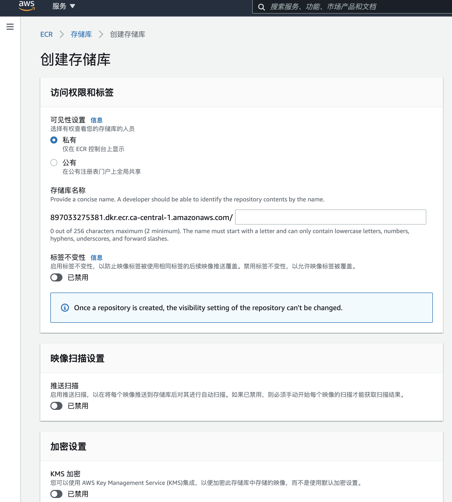

[Amazon Elastic Container Registry（ECR）](https://ca-central-1.console.aws.amazon.com/ecr/get-started?region=ca-central-1)是一个完全托管的容器注册表，可轻松在任何地方存储，管理，共享和部署您的容器映像和工件。

# 1. 创建存储库




# 2. 推送命令

有关更多信息，请参阅 [开始使用 Amazon ECR](https://docs.aws.amazon.com/AmazonECR/latest/userguide/getting-started-cli.html)。

> Mac

## 前提：安装 AWS CLI

see [Installing the AWS CLI version 2](https://docs.aws.amazon.com/cli/latest/userguide/install-cliv2.html)

```bash
% which aws
/usr/local/bin/aws
``` 

## 前提：安装 Docker

go to [the Docker installation guide](https://docs.docker.com/engine/installation/#installation) or [mac_install_docker](https://www.toberoot.com/linux/4_docker/a01_mac_install_docker.html) 

## 检索身份验证令牌并向注册表验证 Docker 客户端身份

```bash
# 请确保您已安装 AWS CLI 和 Docker 的最新版本。有关更多信息，请参阅 开始使用 Amazon ECR 。
# 使用以下步骤进行身份验证并将映像推送到存储库。有关其他注册表身份验证方法(包括 Amazon ECR 凭证助手)，请参阅 注册表身份验证 。
# 检索身份验证令牌并向注册表验证 Docker 客户端身份。
# 使用 AWS CLI:
user@B01202010002-33 ~ % aws ecr get-login-password --region ca-central-1 | docker login --username AWS --password-stdin 897033275381.dkr.ecr.ca-central-1.amazonaws.com
Login Succeeded
```


```bash
# 请确保您已安装 AWS CLI 和 Docker 的最新版本。有关更多信息，请参阅 开始使用 Amazon ECR 。
# 使用以下步骤进行身份验证并将映像推送到存储库。有关其他注册表身份验证方法(包括 Amazon ECR 凭证助手)，请参阅 注册表身份验证 。
# 检索身份验证令牌并向注册表验证 Docker 客户端身份。
# 使用 AWS CLI:
aws ecr get-login-password --region ca-central-1 | docker login --username AWS --password-stdin 897033275381.dkr.ecr.ca-central-1.amazonaws.com

#注意: 如果您在使用 AWS CLI 时收到错误，请确保您已安装 AWS CLI 和 Docker 的最新版本。
#使用以下命令生成 Docker 映像。有关从头生成 Docker 文件的信息，请参阅说明 此处 。如果您已生成映像，则可跳过此步骤:
docker build -t booboo .

# 生成完成后，标记您的映像，以便将映像推送到此存储库:
docker tag booboo:latest 897033275381.dkr.ecr.ca-central-1.amazonaws.com/booboo:latest

# 运行以下命令将此映像推送到您新创建的 AWS 存储库:
docker push 897033275381.dkr.ecr.ca-central-1.amazonaws.com/booboo:latest
```
