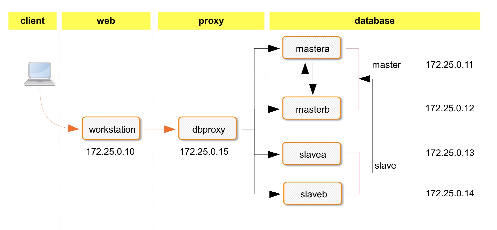

# SQL 考试

```bash
1. mysql 数据库的数据类型分哪三类?
2. SQL 语言分哪四类?
3. select 的五大子句的顺序为?
4. products 表中产品的所有供应商 ID,去除重复
5. products 表中检索一个名为 prod_name 的列,从第 5 行开始显示 4 行
6.products 表中检索 3 个列(prod_id,prod_name,prod_price),按价格 prod_price 以降序排序产 品(最贵的排在最前面),然后再对产
品名排序 prod_name
7. products 表中检索两个列(prod_name,prod_price),但不返回所有行,只返回 prod_name 的
值为 Fuses 的一行
8.检查 customers 表中 cust_email 列不具有 NULL 值的行
9. 检索 products 表,列出价格为 10 美元(含)以上且由 1002 或 1003 制造的所有产品
10. products 表找出以 s 起头以 e 结尾的所有产品
11. products 表产品名称中用正则完成匹配 jetpack 的,不区分大小写
12. 查看数据库的版本
13. 查看当前会话登陆用户
14. goods 表本店价格在 3000 到 5000 之间，或者 500 到 1000 的商品
15. goods 表商品名以诺基亚开头后面只有三个字符的商品
16. goods 表该店一共有多少个商品
17. goods 表查询每个栏目下面最贵商品价格;最低商品价格;商品平均价格;商品库存量; 商品种类
18. goods，brand,category 表查看 KD876 手机所属栏目名称和所属品牌名称 19. 设有成绩表 stu，如下:
+--------+--------+-------+
| name | class | score | +--------+--------+-------+
|张三 |数学 | 90|
|张三 |语文 | 50|
|张三 |地理 | 40|
|李四 |语文 | 55|
|李四 |政治 | 45|
|王五 |政治 | 30| +--------+--------+-------+
试查询两门及两门以上不及格的学生的平均分
20. 创建 t1 表，并设置字符集为 utf8，校对集为 utf8_bin
```

# MySQL 基础管理笔试

```bash
满分 100 分，60 分及格，90 分优秀
一、MYSQL 笔试部分
1. 什么是 mysql?(14)
2. 什么是存储引擎?(2)
3. myisam 和 innodb 的区别?1)事务 2)锁精度 3)适用场景(6)
4. 备份的分类(6)
5. 冷备和热备的区别(8)
6. 冷备的分类(4)
7. 如何查看二进制日志?如何通过参数截取 binlog 的某些行?(6)
8. mysqldump 命令的用法,只写指定参数(10)
    1)备份所有数据库
    2)myisam 存储引擎保证数据一致
    3)innodb 存储一切保证数据一致 4)备份的时候记录二进制日志的信息
    5)刷新日志
9. mysqladmin 命令的用法(6)
    1)mariadb5.5 初始化状态下如何修改 root 用户密码
    2)mariadb5.5root 密码为 uplooking 如何修改成 uplooking123
10. innobackupex 命令的用法(8) 
    1)全备份
    2)1 个增量备份 3)还原数据全备和 1 个增备
11. 还原数据的标准流程，(写出人话皆可，不要求写命令)(10) 
    1)将 mysqldump(逻辑)备份的数据还原
    2)将 perconna xtrabackup(物理)备份的数据还原
12. 冗余环境的搭建步骤，单主从，写出具体步骤(8)
13. mysql 或 mariadb 不同版本对主从同步中的延迟问题的解决方法(6) 
14. 写出 2 个数据库代理服务器的功能(4)
15. 15. 高可用 99.999% 代表一年中能有多久的宕机时间?(2)
```

# 机试

## MySQL分布式集群

> Mycat + MySQL 5.7 基于 GTID 的并行 MTS 多级主从 Multisource Crash safe 半同步架构
 


```bash
@实现以下架构
一: 后端数据库实现多级主从 multisource (30')
    1. GTID master&slave
    2. MTS slave
    3. Crash safe master&slave 
    4. rpl_semi_sync
    5. multisource slavea&slaveb 
    6.双主 mastera&masterb
二: dbproxy 数据库中间件 mycat 实现读写分离和负载均衡 (10')
三: workstation 搭建httpd服务提供动态网站服务即企业博客(10') 
    1. 使用中间件连接数据库
    2. mastera 出故障后能够自动故障转移

@要求对数据库执行以下操作( 30 分)
1. 创建数据库 justice ，创建表 t1(id int primary key) ，插入数据 (1),(2),(3); ( 10 分) 
2. 对数据库做全备份，保存在workstation中名为/tmp/mysql.all.sql;(10分)
3. 全备份后继续执行以下操作:插入4到30000;(10分)

```

## Redis 批量管理

> mastera 上完成 redis 

```bash 
四: Redis 批量管理 (15')
    1. 源码编译 redis 指定家目录为 /usr/local/redis/
    2. 批量生成 50 个 redis 配置文件，存放位置为 /app/redis/conf/ 
    3. 批量管理 redis 服务
```

## MongoDB 基础安装

> mastera 上完成 mongodb

```bash
五: MongoDB 安装使用 (5')
    1. 二进制安装 mongodb 指定路径 /usr/local/mongodb 2. 启动 monodb 服务
```

