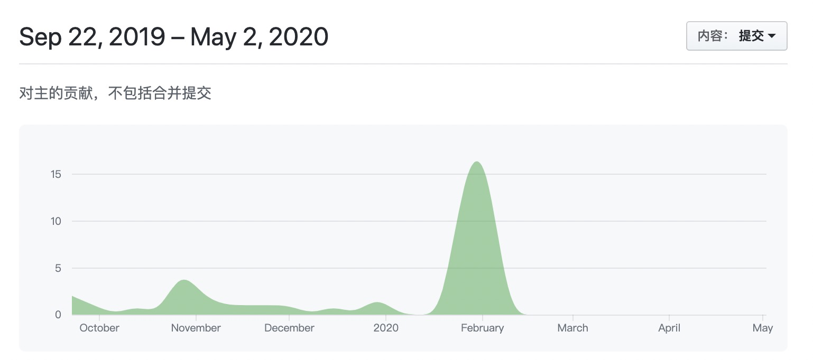

# 内容

* [1z0-071](/database/oracle/ocp/1z0-071.html)
* [1z0-062](/database/oracle/ocp/1z0-062.html)
* [1z0-063](/database/oracle/ocp/1z0-063.html)
* [12c-ocm](/database/oracle/ocp/12c-ocm.html)
    
# Oracle 12c 考试认证

[Oracle官方帮助](https://education.oracle.com/zh_CN/oracle-database/oracle-database-12c-r2/product_626?certPage=true)

- The Oracle Certified Associate (OCA) for Oracle Database 12c assesses fundamental concepts and skills DBAs need for daily operational management and maintenance.
- Building upon the competencies in the Oracle Database 12c OCA certification, the [Oracle Certified Professional (OCP) for Oracle Database 12c](https://education.oracle.com/oracle-database-12c-administrator-certified-professional/trackp_249) includes the advanced knowledge and skills required of top-performing database administrators, including development and deployment of backup, recovery and Cloud computing strategies.
- The [Oracle Certified Master (OCM) for Oracle Database 12c](https://education.oracle.com/oracle-database-12c-administrator-certified-master/trackp_462) - a very challenging and elite top-level certification - certifies the most highly skilled and experienced database experts.

## [OCA](https://education.oracle.com/products/trackp_248)

### [1Z0-071](https://education.oracle.com/products/trackp_248#trackp_248_step_1)

- [Oracle Database 12c SQL 1Z0-071](https://education.oracle.com/products/pexam_1Z0-071)

 考试价格： ¥1077 | 时长： 120分钟 | 及格分数： 63％ | 78题

- [Oracle Database 12c：SQL基础知识1Z0-061](https://education.oracle.com/products/pexam_1Z0-061)  （于2019年11月30日淘汰）
- Oracle简介：SQL和PL / SQL 1Z0-001 **（已**淘汰**）**
- Oracle9i简介：SQL 1Z0-007 **（已**淘汰  **）**
- Oracle Database SQL Expert 1Z0-047 **（已淘汰）**
- Oracle数据库：SQL基础知识I 1Z0-051 **（已**淘汰  **）**

### [1Z0-062](https://education.oracle.com/products/trackp_248#trackp_248_step_2)

-  [Oracle Database 12c管理1Z0-062](https://education.oracle.com/oracle-database-12c-administration/pexam_1Z0-062)

  考试价格： ¥1077 | 时长： 120分钟 | 及格分数： 64％ | 67题

## [OCP](https://education.oracle.com/products/trackp_249)

- [Oracle Database 12c：高级管理1Z0-063](https://education.oracle.com/oracle-database-12c-advanced-administration/pexam_1Z0-063)

考试价格： ¥1077 | 时长： 120分钟 | 及格分数： 60％ | 80题

## [OCM](https://education.oracle.com/oracle-database-12c-administrator-certified-master/trackp_462)

- [Oracle Database 12c认证高级考试12cOCM](https://education.oracle.com/oracle-database-12c-certified-master-exam/pexam_12cOCM)

**考试价格：** ¥9,768 | **时长：** 2 days | **及格分数：** 59.95% | 80题

Oracle考试必须原厂培训或指定合作机构培训才可参加考试。

## 考核分数概览

| 认证                                                         | 编号                                                         | 时长  | 总题数 | **及格分数** | 最大错误题数 |
| ------------------------------------------------------------ | ------------------------------------------------------------ | ----- | ------ | ------------ | ------------ |
| [OCA](https://education.oracle.com/products/trackp_248)      | [1Z0-071](https://education.oracle.com/products/pexam_1Z0-071) | 2小时 | 78     | 63%          | 28           |
|| [1Z0-062](https://education.oracle.com/oracle-database-12c-administration/pexam_1Z0-062) | 2小时                                                        | 67    | 64%    | 24           |
| [OCP](https://education.oracle.com/products/trackp_249)      | [1Z0-063](https://education.oracle.com/oracle-database-12c-advanced-administration/pexam_1Z0-063) | 2小时 | 80     | 60%          | 32           |
| [OCM](https://education.oracle.com/oracle-database-12c-administrator-certified-master/trackp_462) | [12cOCM](https://education.oracle.com/oracle-database-12c-certified-master-exam/pexam_12cOCM) | 2天   | 80     | 59.95%       | 31           |


# 考点明细

* [1Z0-071考点](https://github.com/BoobooWei/DBA_Oracle12cOCP/blob/master/ocp/1Z0-071.md)

* [1Z0-062 考点](https://github.com/BoobooWei/DBA_Oracle12cOCP/blob/master/ocp/1Z0-062.md)

* [1Z0-063 考点](https://github.com/BoobooWei/DBA_Oracle12cOCP/blob/master/ocp/1Z0-063.md)

* [12cOCM 考点](https://github.com/BoobooWei/DBA_Oracle12cOCP/blob/master/ocp/12cOCM.md)

# 大宝的OCP

本定在2020年3月份的OCP考试，因疫情原因推迟到9月底。真正用在学习的时间应该算起来只有3个月。

终于到了认真计划看题的时间节点了。

看题前，先回顾一下学习Oracle 12C的时间段情况：


<p>
  <a class="btn btn-primary" data-toggle="collapse" href="#collapseExample" role="button" aria-expanded="false" aria-controls="collapseExample">
    通过github的commit提交情况统计出每日的活跃时间
  </a>
  <button class="btn btn-primary" type="button" data-toggle="collapse" data-target="#collapseExample2" aria-expanded="false" aria-controls="collapseExample">
    分析结果
  </button>
</p>
<div class="collapse" id="collapseExample">
  <div class="card card-body">
  ```bash
  $ git log --date=iso | perl -nalE 'if (/^Date:\s+[\d-]{10}\s(\d{2})/) { say $1+0 }' | sort | uniq -c|perl -MList::Util=max -nalE '$h{$F[1]} = $F[0]; }{ $m = max values %h; foreach (0..23) { $h{$_} = 0 if not exists $h{$_} } foreach (sort {$a <=> $b } keys %h) { say sprintf "%02d - %4d %s", $_, $h{$_}, "*"x ($h{$_} / $m * 50); }'
  00 -    7 *************************
  01 -    8 ****************************
  02 -    9 ********************************
  03 -    4 **************
  04 -    0
  05 -    0
  06 -    0
  07 -    0
  08 -    0
  09 -    2 *******
  10 -    4 **************
  11 -    1 ***
  12 -    3 **********
  13 -    4 **************
  14 -    8 ****************************
  15 -   11 ***************************************
  16 -   11 ***************************************
  17 -   14 **************************************************
  18 -    8 ****************************
  19 -   13 **********************************************
  20 -    4 **************
  21 -   11 ***************************************
  22 -    8 ****************************
  23 -    4 **************
  ```
  </div>
</div>
<div class="collapse" id="collapseExample2">
  <div class="card card-body">
 1. 学习时间主要集中在下午，晚上和凌晨😄 <br/>
 2. 2019-09-22 22:16:54 ～ 2020-05-03 01:54:30 完成Oracle 12C OCP的所有课程学习（周末上课14天，自己看书做练习）。预计到拿证共 8个月

  </div>
</div>




我的学习记录目前保存在[Github](https://github.com/BoobooWei/DBA_Oracle12cOCP)中，待完成OCP考核后，会逐步完善学习记录和考题到博客中来。


考试/证书仅仅是更好得学习一门技术的方式，而不是目标；考试会让你获得这门技术的广度，日常的学习和工作的实践则收获技术的深度。*


