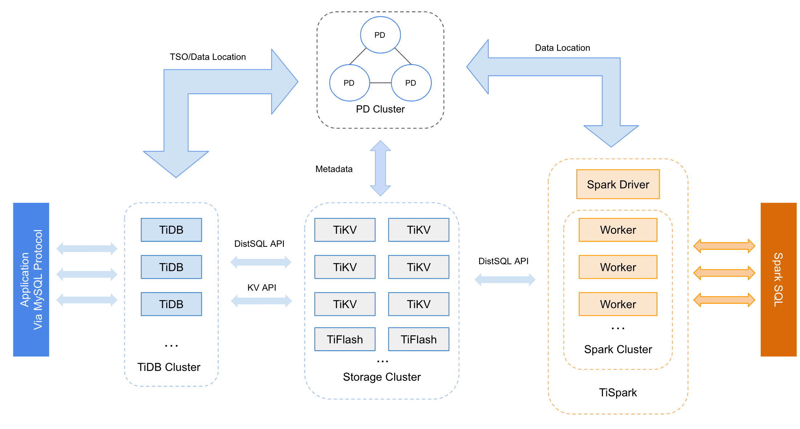

## 学习时长：

10min

## 课程收获：

对 TiDB 的核心组件和生态工具的功能有一定的理解

## 课程内容：

> 本课程简要介绍了 TiDB 核心系统的各个组件以及部分 TiDB 的生态工具

###  TiDB 整体架构

与传统的单机数据库相比，TiDB 具有以下优势：

* 纯分布式架构，拥有良好的扩展性，支持弹性的扩缩容
* 支持 SQL，对外暴露 MySQL 的网络协议，并兼容大多数 MySQL 的语法，在大多数场景下可以直接替换 MySQL
* 默认支持高可用，在少数副本失效的情况下，数据库本身能够自动进行数据修复和故障转移，对业务透明
* 支持 ACID 事务，对于一些有强一致需求的场景友好，例如：银行转账
* 具有丰富的工具链生态，覆盖数据迁移、同步、备份等多种场景

在内核设计上，TiDB 分布式数据库将整体架构拆分成了多个模块，各模块之间互相通信，组成完整的 TiDB 系统。对应的架构图如下：

* TiDB Server：SQL 层，对外暴露 MySQL 协议的连接 endpoint，负责接受客户端的连接，执行 SQL 解析和优化，最终生成分布式执行计划。TiDB 层本身是无状态的，实践中可以启动多个 TiDB 实例，通过负载均衡组件（如 LVS、HAProxy 或 F5）对外提供统一的接入地址，客户端的连接可以均匀地分摊在多个 TiDB 实例上以达到负载均衡的效果。TiDB Server 本身并不存储数据，只是解析 SQL，将实际的数据读取请求转发给底层的存储节点 TiKV（或 TiFlash）。
* PD Server：整个 TiDB 集群的元信息管理模块，负责存储每个 TiKV 节点实时的数据分布情况和集群的整体拓扑结构，提供 TiDB Dashboard 管控界面，并为分布式事务分配事务 ID。PD 不仅存储元信息，同时还会根据 TiKV 节点实时上报的数据分布状态，下发数据调度命令给具体的 TiKV 节点，可以说是整个集群的“大脑”。此外，PD 本身也是由至少 3 个节点构成，拥有高可用的能力。建议部署奇数个 PD 节点。
* 存储节点
  * TiKV Server：负责存储数据，从外部看 TiKV 是一个分布式的提供事务的 Key-Value 存储引擎。存储数据的基本单位是 Region，每个 Region 负责存储一个 Key Range（从 StartKey 到 EndKey 的左闭右开区间）的数据，每个 TiKV 节点会负责多个 Region。TiKV 的 API 在 KV 键值对层面提供对分布式事务的原生支持，默认提供了 SI (Snapshot Isolation) 的隔离级别，这也是 TiDB 在 SQL 层面支持分布式事务的核心。TiDB 的 SQL 层做完 SQL 解析后，会将 SQL 的执行计划转换为对 TiKV API 的实际调用。所以，数据都存储在 TiKV 中。另外，TiKV 中的数据都会自动维护多副本（默认为三副本），天然支持高可用和自动故障转移。
  * TiFlash：TiFlash 是一类特殊的存储节点。和普通 TiKV 节点不一样的是，在 TiFlash 内部，数据是以列式的形式进行存储，主要的功能是为分析型的场景加速。

### TiDB 的生态工具

#### 全量导出

[Dumpling](https://docs.pingcap.com/zh/tidb/stable/dumpling-overview) 是一个用于从 MySQL/TiDB 进行全量逻辑导出的工具。

基本信息：

* Dumpling 的输入：MySQL/TiDB 集群
* Dumpling 的输出：SQL/CSV 文件
* 适用 TiDB 版本：所有版本
* Kubernetes 支持：尚未支持

#### 全量导入

[TiDB Lightning](https://docs.pingcap.com/zh/tidb/stable/tidb-lightning-overview) 是一个用于将全量数据导入到 TiDB 集群的工具。

使用 TiDB Lightning 导入数据到 TiDB 时，有三种模式：

* `local`  模式：TiDB Lightning 将数据解析为有序的键值对，并直接将其导入 TiKV。这种模式一般用于导入大量的数据（TB 级别）到新集群，但在数据导入过程中集群无法提供正常的服务。
* `importer`  模式：和  `local`  模式类似，但是需要部署额外的组件  `tikv-importer`  协助完成键值对的导入。对于 4.0 以上的目标集群，请优先使用  `local`  模式进行导入。
* `tidb`  模式：以 TiDB/MySQL 作为后端，这种模式相比  `local`  和  `importer`  模式的导入速度较慢，但是可以在线导入，同时也支持将数据导入到 MySQL。

基本信息：

* Lightning 的输入：
  * Dumpling 输出文件
  * 其他格式兼容的 CSV 文件
* 适用 TiDB 版本：v2.1 及以上
* Kubernetes 支持：[使用 TiDB Lightning 快速恢复 Kubernetes 上的 TiDB 集群数据](https://docs.pingcap.com/zh/tidb-in-kubernetes/v1.1/restore-data-using-tidb-lightning)

> **注意：**
>
>
>
> 原 Loader 工具已停止维护，不再推荐使用。相关场景请使用 TiDB Lightning 的  `tidb`  模式进行替代，详细信息请参考 [TiDB Lightning TiDB-backend 文档](https://docs.pingcap.com/zh/tidb/stable/tidb-lightning-backends#%E4%BB%8E-loader-%E8%BF%81%E7%A7%BB%E5%88%B0-tidb-lightning-tidb-backend)。

#### 备份和恢复

[BR](https://docs.pingcap.com/zh/tidb/stable/backup-and-restore-tool) 是一个对 TiDB 进行分布式备份和恢复的工具，可以高效地对大数据量的 TiDB 集群进行数据备份和恢复。

基本信息：

* [备份输出和恢复输入的文件类型](https://docs.pingcap.com/zh/tidb/stable/backup-and-restore-tool#%E5%A4%87%E4%BB%BD%E6%96%87%E4%BB%B6%E7%B1%BB%E5%9E%8B)：SST +  `backupmeta`  文件
* 适用 TiDB 版本：v3.1 及 v4.0
* Kubernetes 支持：[使用 BR 工具备份 TiDB 集群数据到兼容 S3 的存储](https://docs.pingcap.com/zh/tidb-in-kubernetes/v1.1/backup-to-aws-s3-using-br), [使用 BR 工具恢复 S3 兼容存储上的备份数据](https://docs.pingcap.com/zh/tidb-in-kubernetes/v1.1/restore-from-aws-s3-using-br)

#### TiDB 增量日志同步

[TiDB Binlog](https://docs.pingcap.com/zh/tidb/stable/tidb-binlog-overview) 是收集 TiDB 的增量 binlog 数据，并提供准实时同步和备份的工具。该工具可用于 TiDB 集群间的增量数据同步，如将其中一个 TiDB 集群作为另一个 TiDB 集群的从集群。

基本信息：

* TiDB Binlog 的输入：TiDB 集群
* TiDB Binlog 的输出：TiDB 集群、MySQL、Kafka 或者增量备份文件
* 适用 TiDB 版本：v2.1 及以上
* Kubernetes 支持：[TiDB Binlog 运维文档](https://docs.pingcap.com/zh/tidb-in-kubernetes/v1.1/deploy-tidb-binlog)，[Kubernetes 上的 TiDB Binlog Drainer 配置](https://docs.pingcap.com/zh/tidb-in-kubernetes/v1.1/configure-tidb-binlog-drainer)

#### 数据迁入

[TiDB Data Migration (DM)](https://docs.pingcap.com/zh/tidb-data-migration/v2.0/overview) 是将 MySQL/MariaDB 数据迁移到 TiDB 的工具，支持全量数据和增量数据的迁移。

基本信息：

* DM 的输入：MySQL/MariaDB
* DM 的输出：TiDB 集群
* 适用 TiDB 版本：所有版本
* Kubernetes 支持：开发中

如果数据量在 TB 级别以下，推荐直接使用 DM 迁移 MySQL/MariaDB 数据到 TiDB（迁移的过程包括全量数据的导出导入和增量数据的同步）。

如果数据量在 TB 级别，推荐的迁移步骤如下：

1. 使用 [Dumpling](https://docs.pingcap.com/zh/tidb/stable/dumpling-overview) 导出 MySQL/MariaDB 全量数据。
2. 使用 [TiDB Lightning](https://docs.pingcap.com/zh/tidb/stable/tidb-lightning-overview) 将全量导出数据导入 TiDB 集群。
3. 使用 DM 迁移 MySQL/MariaDB 增量数据到 TiDB。

## 学习过程中参考的其他资料

- [视频教程-1.4 The TiDB platform architecture and landscape（TiDB 4.0 架构概览）](https://university.pingcap.com/courses/TiDB%204.0%20%E6%96%B0%E6%89%8B%E6%8C%87%E5%8D%97/chapter/101-%E7%AB%A0%E8%8A%82/lesson/The-TiDB-platform-architecture-and-landscape)
- [TiDB 生态工具功能概览](https://docs.pingcap.com/zh/tidb/stable/ecosystem-tool-user-guide)
- [TiDB 架构](https://docs.pingcap.com/zh/tidb/stable/tidb-architecture)
