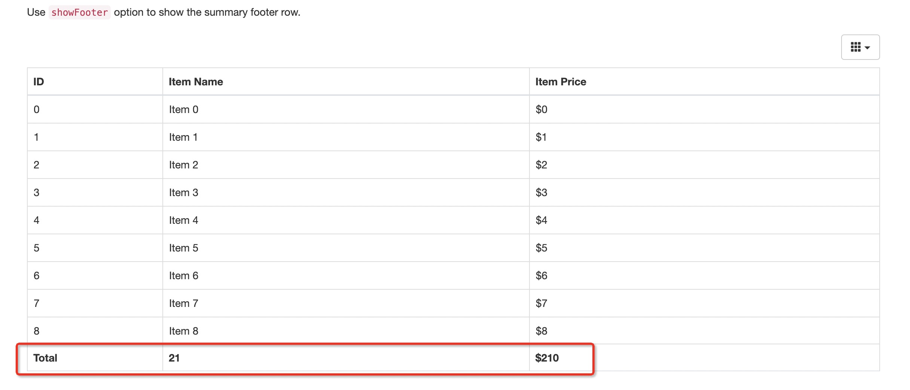

## 效果图



## 代码说明

[bootstrap-table](https://www.bootstrap-table.com.cn/)


## 操作指南

1. 修改虚拟环境中的 模板 base.html

```bash
cd venv/lib/python2.7/site-packages/flask_admin/templates/bootstrap3/admin
vim base.html
```

内容如下：
```html


<!DOCTYPE html>
<html>
   <head>
    <title>{{ admin_view.category }} - {{ admin_view.name }} - {{ admin_view.admin.name }}</title>
    
        <meta charset="UTF-8">
        <meta http-equiv="X-UA-Compatible" content="IE=edge,chrome=1">
        <meta name="viewport" content="width=device-width, initial-scale=1.0">
        <meta name="description" content="">
        <meta name="author" content="">
    
    
        <link href="{{ admin_static.url(filename='bootstrap/bootstrap3/swatch/{swatch}/bootstrap.min.css'.format(swatch=config.get('FLASK_ADMIN_SWATCH', 'default')), v='3.3.5') }}" rel="stylesheet">
        
        <link href="{{ admin_static.url(filename='bootstrap/bootstrap3/css/bootstrap-theme.min.css', v='3.3.5') }}" rel="stylesheet">
        
        <link href="{{ admin_static.url(filename='admin/css/bootstrap3/admin.css', v='1.1.1') }}" rel="stylesheet">
	<link href="{{ admin_static.url(filename='admin/css/bootstrap3/submenu.css') }}" rel="stylesheet">
        
          
            <link href="{{ css_url }}" rel="stylesheet">
          
        
        <style>
        body {
            padding-top: 4px;
        }
        </style>
           <link rel="stylesheet" href="https://unpkg.com/@fortawesome/fontawesome-free@5.12.1/css/all.min.css">
    <script src="https://cdnjs.cloudflare.com/ajax/libs/jquery/3.5.1/jquery.min.js"
            integrity="sha512-bLT0Qm9VnAYZDflyKcBaQ2gg0hSYNQrJ8RilYldYQ1FxQYoCLtUjuuRuZo+fjqhx/qtq/1itJ0C2ejDxltZVFg=="
            crossorigin="anonymous"></script>


       <link href="https://unpkg.com/bootstrap-table@1.18.0/dist/bootstrap-table.min.css" rel="stylesheet">
    <script src="https://unpkg.com/bootstrap-table@1.18.0/dist/bootstrap-table.min.js"></script>
    <script id="_carbonads_projs" type="text/javascript"
            src="https://srv.carbonads.net/ads/CK7DL2J7.json?segment=placement:bootstrap-tablecom&amp;callback=_carbonads_go"></script>

    
    
    
    
    
  </head>
  <body>
    
    <div class="container-fluid">
      <nav class="navbar navbar-default" role="navigation">
        <!-- Brand and toggle get grouped for better mobile display -->
        <div class="navbar-header">
          <button type="button" class="navbar-toggle" data-toggle="collapse" data-target="#admin-navbar-collapse">
            <span class="sr-only">Toggle navigation</span>
            <span class="icon-bar"></span>
            <span class="icon-bar"></span>
            <span class="icon-bar"></span>
          </button>
          
          <a class="navbar-brand" href="{{ admin_view.admin.url }}">{{ admin_view.admin.name }}</a>
          
        </div>
        <!-- navbar content -->
        <div class="collapse navbar-collapse" id="admin-navbar-collapse">
          
          <ul class="nav navbar-nav">
            {{ layout.menu() }}
          </ul>
          

          
          <ul class="nav navbar-nav navbar-right">
            {{ layout.menu_links() }}
          </ul>
          
          
          
        </div>
      </nav>

      
      {{ layout.messages() }}
      

      {# store the jinja2 context for form_rules rendering logic #}
      

      
    </div>
    

    <script src="{{ admin_static.url(filename='vendor/jquery.min.js', v='2.1.4') }}" type="text/javascript"></script>
    <script src="{{ admin_static.url(filename='bootstrap/bootstrap3/js/bootstrap.min.js', v='3.3.5') }}" type="text/javascript"></script>
    <script src="{{ admin_static.url(filename='vendor/moment.min.js', v='2.9.0') }}" type="text/javascript"></script>
    <script src="{{ admin_static.url(filename='vendor/select2/select2.min.js', v='3.5.2') }}" type="text/javascript"></script>
    
      
        <script src="{{ js_url }}" type="text/javascript"></script>
      
    
    

    
    
  </body>
</html>
```

2. 修改 list.html

```bash
vim venv/lib/python2.7/site-packages/flask_admin/templates/bootstrap3/admin/model/list.html
```

list.html明细如下
```html








{{ super() }}
{{ lib.form_css() }}



<div class="panel panel-default">
    <div class="panel-body">
        {{ admin_view.category }} - {{ admin_view.name }}
    </div>
</div>


<ul class="nav nav-tabs actions-nav">
    <li class="active">
        <a href="javascript:void(0)">{{ _gettext('List') }} ({{ count }})</a>
    </li>

    
    <li>
        
        {{ lib.add_modal_button(url=get_url('.create_view', url=return_url, modal=True), title=_gettext('Create New
        Record'), content=_gettext('Create')) }}
        
        <a href="{{ get_url('.create_view', url=return_url) }}" title="{{ _gettext('Create New Record') }}">{{
            _gettext('Create') }}</a>
        
    </li>
    

    
    {{ model_layout.export_options() }}
    

    

    
    <li class="dropdown">
        {{ model_layout.filter_options() }}
    </li>
    

    
    <li class="dropdown">
        {{ model_layout.page_size_form(page_size_url) }}
    </li>
    

    
    <li class="dropdown">
        {{ actionlib.dropdown(actions) }}
    </li>
    

    
    <li>
        {{ model_layout.search_form() }}
    </li>
    
    
</ul>



{{ model_layout.filter_form() }}
<div class="clearfix"></div>



<div class="table table-striped table-bordered table-hover model-list" style="white-space:nowrap">

    <table
            id="booboo_table"
            data-toggle="table"
            data-show-columns="true"
            data-show-footer="true">
        <thead>
        <tr>
            
            
            <th class="list-checkbox-column">
                <input type="checkbox" name="rowtoggle" class="action-rowtoggle"
                       title="{{ _gettext('Select all records') }}"/>
            </th>
            
            
            
            <th class="col-md-1" data-field="id" data-footer-formatter="idFormatter"></th>
            
            
            
            
            
            <th data-field="price" data-footer-formatter="priceFormatter" class="column-header col-{{c}}">
                
            <th class="column-header col-{{c}}">
                
                
                
                <a href="{{ sort_url(column, True) }}" title="{{ _gettext('Sort by %(name)s', name=name) }}">
                    {{ name }}
                    
                    <span class="fa fa-chevron-up glyphicon glyphicon-chevron-up"></span>
                    
                    <span class="fa fa-chevron-down glyphicon glyphicon-chevron-down"></span>
                    
                </a>
                
                <a href="{{ sort_url(column) }}" title="{{ _gettext('Sort by %(name)s', name=name) }}">{{ name }}</a>
                
                
                {{ name }}
                
                
                <a class="fa fa-question-circle glyphicon glyphicon-question-sign"
                   title="{{ admin_view.column_descriptions[c] }}"
                   href="javascript:void(0)" data-role="tooltip"
                ></a>
                
            </th>
            
            
        </tr>
        </thead>
        
        <tr>
            
            
            <td>
                <input type="checkbox" name="rowid" class="action-checkbox" value="{{ get_pk_value(row) }}"
                       title="{{ _gettext('Select record') }}"/>
            </td>
            
            
            
            <td class="list-buttons-column">
                
                
                {{ action.render_ctx(get_pk_value(row), row) }}
                
                
            </td>
            
            

            
            <td class="col-{{c}}">
                
                
                
                {{ form[c](pk=get_pk_value(row), display_value=get_value(row, c), csrf=form.csrf_token._value()) }}
                
                {{ form[c](pk=get_pk_value(row), display_value=get_value(row, c)) }}
                
                
                {{ get_value(row, c) }}
                
            </td>
            
            
        </tr>
        
        <tr>
            <td colspan="999">
                
                <div class="text-center">
                    {{ admin_view.get_empty_list_message() }}
                </div>
                
            </td>
        </tr>
        
    </table>
</div>

<!--booboo test-->
<script>
  function idFormatter() {
    return 'Total'
  }

  function nameFormatter(data) {
    return data.length
  }

  function priceFormatter(data) {
    var field = this.field
    return '$' + data.map(function (row) {
      return +row[field].substring(1)
    }).reduce(function (sum, i) {
      return sum + i
    }, 0)
  }


</script>
<!--booboo test-->



{{ lib.pager(page, num_pages, pager_url) }}

{{ lib.simple_pager(page, data|length == page_size, pager_url) }}





{{ actionlib.form(actions, get_url('.action_view')) }}



{{ lib.add_modal_window() }}




{{ super() }}


<div id="filter-groups-data" style="display:none;">{{ filter_groups|tojson|safe }}</div>
<div id="active-filters-data" style="display:none;">{{ active_filters|tojson|safe }}</div>



<script src="{{ admin_static.url(filename='admin/js/filters.js', v='1.0.0') }}"></script>
{{ lib.form_js() }}

{{ actionlib.script(_gettext('Please select at least one record.'),
actions,
actions_confirmation) }}

```

## 操作记录
```bash 
/alidata/fms-backup/venv/lib/python2.7/site-packages/flask_admin/templates/bootstrap3/admin
(venv) [root@fms admin]# ll
总用量 40
-rw-r--r-- 1 root root 1389 10月 20 20:01 actions.html
-rw-r--r-- 1 root root 4030 10月 20 20:01 base.html
drwxr-xr-x 3 root root   54 10月 20 20:01 file
-rw-r--r-- 1 root root   67 10月 20 20:01 index.html
-rw-r--r-- 1 root root 4129 10月 20 20:01 layout.html
-rw-r--r-- 1 root root 8655 10月 20 20:01 lib.html
-rw-r--r-- 1 root root   34 10月 20 20:01 master.html
drwxr-xr-x 3 root root  219 10月 20 20:01 model
drwxr-xr-x 2 root root   47 10月 20 20:01 rediscli
-rw-r--r-- 1 root root   89 10月 20 20:01 static.html
(venv) [root@fms admin]# cp base.html base.html.bac
(venv) [root@fms admin]# > base.html
(venv) [root@fms admin]# vim base.html
(venv) [root@fms admin]# ls
actions.html  base.html  base.html.bac  file  index.html  layout.html  lib.html  master.html  model  rediscli  static.html
(venv) [root@fms admin]# cd model/
(venv) [root@fms model]# ll
总用量 44
-rw-r--r-- 1 root root  705 10月 20 20:01 create.html
-rw-r--r-- 1 root root 1447 10月 20 20:01 details.html
-rw-r--r-- 1 root root 1070 10月 20 20:01 edit.html
-rw-r--r-- 1 root root  410 10月 20 20:01 inline_field_list.html
-rw-r--r-- 1 root root  153 10月 20 20:01 inline_form.html
-rw-r--r-- 1 root root 2206 10月 20 20:01 inline_list_base.html
-rw-r--r-- 1 root root 4145 10月 20 20:01 layout.html
-rwxr-xr-x 1 root root 7615 10月 20 20:01 list.html
drwxr-xr-x 2 root root   62 10月 20 20:01 modals
-rw-r--r-- 1 root root 1726 10月 20 20:01 row_actions.html
(venv) [root@fms model]# pwd
/alidata/fms-backup/venv/lib/python2.7/site-packages/flask_admin/templates/bootstrap3/admin/model
(venv) [root@fms model]# cp list.html list.html.bac
(venv) [root@fms model]# > list.html
(venv) [root@fms model]# vim list.html
```
## demo

```html
<!doctype html>
<html lang="en">
<head>
    <title>Bootstrap Table Examples</title>
    <meta charset="utf-8">
    <meta http-equiv="X-UA-Compatible" content="IE=edge">
    <meta name="description"
          content="An extended Bootstrap table with radio, checkbox, sort, pagination, and other added features.">
    <meta name="keywords"
          content="table, bootstrap, bootstrap plugin, bootstrap resources, bootstrap table, jQuery plugin">
    <meta name="author" content="Zhixin Wen, and Bootstrap table contributors">
    <!-- <meta name="viewport" content="width=device-width, initial-scale=1, shrink-to-fit=no"> -->

    <link rel="stylesheet" href="https://cdnjs.cloudflare.com/ajax/libs/twitter-bootstrap/3.4.1/css/bootstrap.min.css">

    <link rel="stylesheet" href="https://unpkg.com/@fortawesome/fontawesome-free@5.12.1/css/all.min.css">
    <link rel="stylesheet" href="https://cdnjs.cloudflare.com/ajax/libs/highlight.js/9.13.1/styles/default.min.css">
    <link rel="stylesheet" href="https://cdnjs.cloudflare.com/ajax/libs/hint.css/2.5.1/hint.min.css">
    <link rel="stylesheet" href="assets/css/docs.min.css">
    <link rel="stylesheet" href="assets/css/template.css?v=131">

    <script type="text/javascript" async="" src="https://www.google-analytics.com/analytics.js"></script>
    <script src="https://cdnjs.cloudflare.com/ajax/libs/jquery/3.5.1/jquery.min.js"
            integrity="sha512-bLT0Qm9VnAYZDflyKcBaQ2gg0hSYNQrJ8RilYldYQ1FxQYoCLtUjuuRuZo+fjqhx/qtq/1itJ0C2ejDxltZVFg=="
            crossorigin="anonymous"></script>
    <script src="https://cdnjs.cloudflare.com/ajax/libs/twitter-bootstrap/3.4.1/js/bootstrap.min.js"></script>
    <script src="https://cdnjs.cloudflare.com/ajax/libs/sprintf/1.1.2/sprintf.min.js"></script>
    <script src="https://cdnjs.cloudflare.com/ajax/libs/highlight.js/9.13.1/highlight.min.js"></script>
    <script src="https://cdn.jsdelivr.net/npm/marked/marked.min.js"></script>
    <script src="https://unpkg.com/flexibility@2.0.1/flexibility.js"></script>
    <script src="assets/js/template.js?v=131"></script>

    <!-- Global site tag (gtag.js) - Google Analytics -->
    <script async="" src="https://www.googletagmanager.com/gtag/js?id=UA-132747866-1"></script>
    <script>
    window.dataLayer = window.dataLayer || []
    function gtag() {window.dataLayer.push(arguments)}
    gtag('js', new Date())
    gtag('config', 'UA-132747866-1')


    </script>
    <link href="https://unpkg.com/bootstrap-table@1.18.0/dist/bootstrap-table.min.css" rel="stylesheet">
    <script src="https://unpkg.com/bootstrap-table@1.18.0/dist/bootstrap-table.min.js"></script>
    <script id="_carbonads_projs" type="text/javascript"
            src="https://srv.carbonads.net/ads/CK7DL2J7.json?segment=placement:bootstrap-tablecom&amp;callback=_carbonads_go"></script>
</head>
<body>
<div class="container">
    <div class="header-wrapper">
        <div class="title-desc">

            <p class="bd-lead">
            <p>Use <code>showFooter</code> option to show the summary footer row.</p>
            </p>
        </div>

        <div id="example">
            <script>
              init({
                title: 'Show Footer',
                desc: 'Use `showFooter` option to show the summary footer row.',
                links: ['bootstrap-table.min.css'],
                scripts: ['bootstrap-table.min.js']
              })


            </script>

            <table
                    id="table"
                    data-toggle="table"
                    data-height="460"
                    data-show-columns="true"
                    data-show-footer="true"
                    data-url="json/data1.json">
                <thead>
                <tr>
                    <th data-field="id" data-footer-formatter="idFormatter">ID</th>
                    <th data-field="name" data-footer-formatter="nameFormatter">Item Name</th>
                    <th data-field="price" data-footer-formatter="priceFormatter">Item Price</th>
                </tr>
                </thead>
            </table>

            <script>
  function idFormatter() {
    return 'Total'
  }

  function nameFormatter(data) {
    return data.length
  }

  function priceFormatter(data) {
    var field = this.field
    return '$' + data.map(function (row) {
      return +row[field].substring(1)
    }).reduce(function (sum, i) {
      return sum + i
    }, 0)
  }

            </script>
        </div>

        <script src="https://cdnjs.cloudflare.com/ajax/libs/jquery/3.5.1/jquery.min.js"
                integrity="sha512-bLT0Qm9VnAYZDflyKcBaQ2gg0hSYNQrJ8RilYldYQ1FxQYoCLtUjuuRuZo+fjqhx/qtq/1itJ0C2ejDxltZVFg=="
                crossorigin="anonymous"></script>
        <script src="https://cdn.jsdelivr.net/npm/popper.js@1.16.0/dist/umd/popper.min.js"
                integrity="sha384-Q6E9RHvbIyZFJoft+2mJbHaEWldlvI9IOYy5n3zV9zzTtmI3UksdQRVvoxMfooAo"
                crossorigin="anonymous"></script>
        <script src="https://stackpath.bootstrapcdn.com/bootstrap/4.5.0/js/bootstrap.min.js"
                integrity="sha384-OgVRvuATP1z7JjHLkuOU7Xw704+h835Lr+6QL9UvYjZE3Ipu6Tp75j7Bh/kR0JKI"
                crossorigin="anonymous"></script>
        <script>$.browser = {}</script>
        <script src="https://cdn.jsdelivr.net/npm/jquery-hashchange@2.0.0/jquery.ba-hashchange.min.js"></script>
        <script src="https://cdn.jsdelivr.net/npm/algoliasearch@3.32.0/dist/algoliasearchLite.min.js"></script>
        <script src="https://cdn.jsdelivr.net/npm/instantsearch.js@3.0.0/dist/instantsearch.production.min.js"></script>
        <script src="assets/js/docs.min.js"></script>
        <script src="assets/js/index.js?v=131"></script>
    </div>
</div>
</body>
</html>

```
