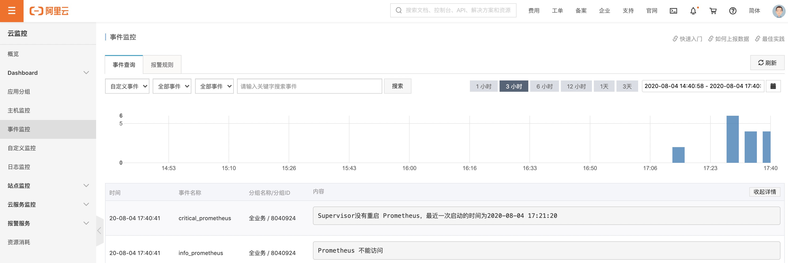
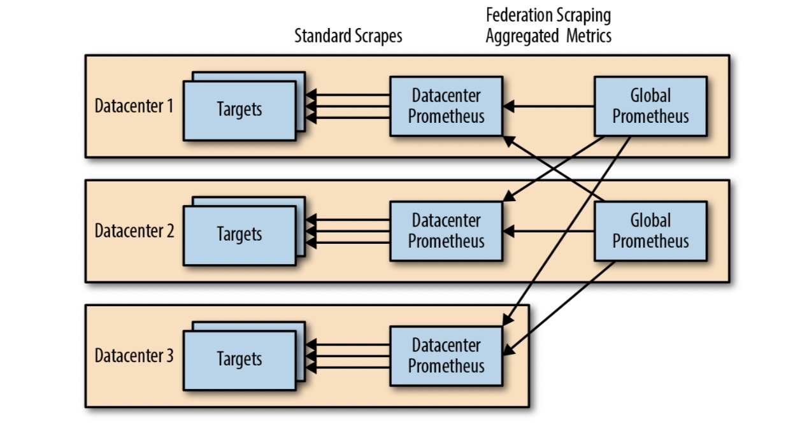

# 好的资料

[国内Prometheus交流](https://www.kancloud.cn/yetship/prometheus_practice/462166)

[国外Prometheus交流](https://training.robustperception.io/)

# 部署单实例节点

## 安装脚本

```bash 
#!/bin/bash

path='/usr/local/cloudcare'
basepath=$(cd `dirname $0`; pwd)

echo -n "Please enter your project name："
read project

### check app ###
check_app ()
{
prom=`ps -ef|grep prometheus|grep life|wc -l`

if [ $prom == 1 ];then
	echo "################################"
	echo "Prometheus is already exists"
	echo "################################"
	exit 1
fi
}

### install app ###
install_app ()
{
### install prometheus ###
mkdir -p /usr/local/cloudcare
echo "################################"
echo "Waiting for installation prometheus"
wget -q http://zy-prometheus.oss-cn-hangzhou.aliyuncs.com/Source%20Code/prometheus.tar.gz
tar -zxf prometheus.tar.gz -C /usr/local/cloudcare
rm -f $basepath/prometheus.tar.gz
mkdir -p /usr/local/cloudcare/prometheus/{bin,log,json,exporter,rules}

cat > $path/prometheus/bin/start_prom.sh <<EOF
#!/bin/bash
cd $path/prometheus/
nohup $path/prometheus/prometheus --web.enable-lifecycle --config.file=$path/prometheus/prometheus.yml 1>>$path/prometheus/log/start_prom.log 2>&1 &
EOF
chmod 755 $path/prometheus/bin/start_prom.sh
}

### config  app ###
config_app()
{
### prometheus ###
sed -i '/scrape_interval:/c\\  scrape_interval: 60s' $path/prometheus/prometheus.yml
sed -i '/evaluation_interval:/c\\  evaluation_interval: 60s' $path/prometheus/prometheus.yml
sed -i ':a;N;$!ba;s/    - targets:/    - targets: ["127.0.0.1:9093"]/' $path/prometheus/prometheus.yml
sed -i "/rule_files/a\\   - '$path/prometheus/rules/*.yml'" $path/prometheus/prometheus.yml
sed -i "/evaluation_interval:/a\\  external_labels:" $path/prometheus/prometheus.yml
sed -i "/external_labels/a\\    project: '$project'" $path/prometheus/prometheus.yml
sed -i "/scrape_configs:/a\\  - job_name: 'autojson' \n    file_sd_configs: \n    - files: \n      - '$path/prometheus/json/*.json'" $path/prometheus/prometheus.yml
python $path/prometheus/bin/exc2conf.py
}

### auto_check ###
auto_check ()
{
auto_prom=`cat /etc/rc.local |grep start_prom|wc -l`

if [ $auto_prom == 0 ];then
	echo "$path/prometheus/bin/start_prom.sh" >>/etc/rc.local

fi
if [ $auto_alert == 0 ];then
	echo "$path/alertmanager/bin/start_alert.sh" >>/etc/rc.local

fi
if [ $auto_grafana == 0 ];then
	echo "$path/grafana/bin/start_grafana.sh" >>/etc/rc.local
fi
}

### start app ###
start_app ()
{
	cd $path/prometheus
	sh $path/prometheus/bin/start_prom.sh
	echo "################################"
	echo "Prometheus is running"

	echo "################################"
	rm -f $basepath/$0
}

check_app
install_app
config_app
auto_check
start_app
```

## 优化方案1


Prometheus优化方案1—systemctl和logrotate管理服务和日志


如果是 RedHat or Centos 7 版本可以通过一下脚本进行优化

```bash
#!/bin/bash
# 1 添加systemctl的lib脚本
cat > /usr/lib/systemd/system/prometheus.service << ENDF
 
 
[Unit]
Description=Prometheus
Documentation=https://prometheus.io/docs/introduction/overview/
Wants=network-online.target
After=network-online.target
 
[Service]
User=root
Group=root
Type=simple
# 启动脚本
ExecStart=/usr/local/cloudcare/prometheus/bin/prometheus.sh
 
[Install]
WantedBy=multi-user.target
ENDF

# 2 编写prometheus启动命令脚本
cat > /usr/local/cloudcare/prometheus/bin/prometheus.sh << ENDF
#!/bin/sh
cd /usr/local/cloudcare/prometheus/
/usr/local/cloudcare/prometheus/prometheus --web.enable-lifecycle --config.file=/usr/local/cloudcare/prometheus/prometheus.yml 1>>/usr/local/cloudcare/prometheus/log/start_prom.log 2>&1
ENDF
 
chmod 755 /usr/local/cloudcare/prometheus/bin/prometheus.sh

# 3 验证启动
systemctl daemon-reload
# 配置开机加载
systemctl enable prometheus.service
# 启动
kill -9 `ps -ef|grep [p]rometheus | awk '{print $2}'`
systemctl start prometheus
# 查看状态
systemctl status prometheus

# 安装logrotate
yum install -y logrotate
# 查看软件
rpm -ql logrotate
# 修改 logrotate 配置文件/etc/logrotate.conf
cat >> /etc/logrotate.conf << ENDF
# prometheus start
/usr/local/cloudcare/prometheus/log/start_prom.log {
daily
rotate 7
dateext
create
}
# prometheus end
ENDF


# 测试
logrotate -vf /etc/logrotate.conf
# 查看日志轮询结果
ll /usr/local/cloudcare/prometheus/log/

```

清除优化脚本

```bash
#!/bin/bash
systemctl disable prometheus.service
systemctl stop prometheus
mv /usr/lib/systemd/system/prometheus.service /usr/local/cloudcare/prometheus/bin/prometheus.service.back
systemctl daemon-reload
sed -i '/# prometheus start/,/# prometheus end/d' /etc/logrotate.conf
```

## 优化方案2


Prometheus优化方案2—通过supervisor管理服务和日志


前提：安装Python3的环境

```bash
pip3 install supervisor
echo_supervisord_conf > /etc/supervisord/supervisord.conf
cat > /etc/supervisord.conf << ENDF
[unix_http_server]
file=/tmp/supervisor.sock   ; the path to the socket file
 
 
 
[supervisord]
logfile=/tmp/supervisord.log ; main log file; default $CWD/supervisord.log
logfile_maxbytes=50MB        ; max main logfile bytes b4 rotation; default 50MB
logfile_backups=10           ; # of main logfile backups; 0 means none, default 10
loglevel=info                ; log level; default info; others: debug,warn,trace
pidfile=/tmp/supervisord.pid ; supervisord pidfile; default supervisord.pid
nodaemon=false               ; start in foreground if true; default false
silent=false                 ; no logs to stdout if true; default false
minfds=1024                  ; min. avail startup file descriptors; default 1024
minprocs=200                 ; min. avail process descriptors;default 200
 
 
[rpcinterface:supervisor]
supervisor.rpcinterface_factory = supervisor.rpcinterface:make_main_rpcinterface
 
 
[supervisorctl]
serverurl=unix:///tmp/supervisor.sock ; use a unix:// URL  for a unix socket
 
 
[program:prometheus]
command=/usr/local/cloudcare/prometheus/prometheus --web.enable-lifecycle --config.file=/usr/local/cloudcare/prometheus/prometheus.yml              ; the program (relative uses PATH, can take args)
directory=/usr/local/cloudcare/prometheus/                ; directory to cwd to before exec (def no cwd)
autostart=true                ; start at supervisord start (default: true)
stdout_logfile=/usr/local/cloudcare/prometheus/log/supervisor_prometheus.log        ; stdout log path, NONE for none; default AUTO
stdout_logfile_maxbytes=1MB   ; max # logfile bytes b4 rotation (default 50MB)
stdout_logfile_backups=7     ; # of stdout logfile backups (0 means none, default 10)
stderr_logfile=/usr/local/cloudcare/prometheus/log/supervisor_prometheus.err        ; stderr log path, NONE for none; default AUTO
stderr_logfile_maxbytes=1MB   ; max # logfile bytes b4 rotation (default 50MB)
stderr_logfile_backups=7     ; # of stderr logfile backups (0 means none, default 10)
ENDF

supervisord -c /etc/supervisord/supervisord.conf
```

## 告警通知

结合优化方案2的supervisor 和 Bash脚本推送故障事件 来实现 Supervisor在Prometheus进程异常结束后的未能重启 时通知运维。

关于脚本中使用的 **阿里云云监控自定义事件和告警** 的功能，参考文章：《阿里云云监控实现进程监控告警》

```bash 
#!/bin/bash
# Author        :      BoobooWei
# DateTime      :      2020-08-03
# Info          :      Prometheus进程监控脚本
# Help          :      配置步骤如下：
#                      1)阿里云CMS控制台——“事件监控”——“告警规则”——“自定义事件”，创建用于进程丢失后的上报事件名称和告警触发的规则；
#                         自定义事件 info_prometheus
#                         自定义事件 warn_prometheus
#                         自定义事件 critical_prometheus
#                      2)修改脚本中的变量
#                      3)配置crontab
#                          */1 * * * * /usr/bin/bash /alidata/monitor/process_monitor.sh
# Test          :      可以执行 bash -x xxx.sh 查看执行过程
# Doc           :       https://confluence.jiagouyun.com/pages/viewpage.action?pageId=124261615


# prometheus的日志路径
log_file=/usr/local/cloudcare/prometheus/log/supervisor_prometheus.err
# RAM权限
accessid=xxx
accesssecret=xxx
# ram_role_name=RamRoleName # 更安全
#地域
region=cn-shanghai
#自定义事件归属的业务分组ID
GroupId=8040924
# 自定义事件名 info_prometheus
# 自定义事件名 warn_prometheus
# 自定义事件名 critical_prometheus
info_prometheus=info_prometheus
warn_prometheus=warn_prometheus
critical_prometheus=critical_prometheus

# 通过文件锁来控制当前脚本是否正在执行
if [[ -f /tmp/.check_prometheus_try_start ]]; then exit; fi


check_prometheus(){
# 判断 prometheus 服务是否可用
# 可用 返回True 否则返回 False
a=`curl 127.0.0.1:9090 2> /dev/null`
echo $a | grep Found
if [[ $? == 0 ]]
then
  check_result=1 # 活着
else
  check_result=0 # 挂了
fi
}


restart_prometheus(){
  # 正常情况下 supervisord 会自动启动被异常结束的prometheus进程，注意如果是人为手动正常通过 kill pid的方式关闭的，将不会自动重启。
  # 此处上报prometheus当前的日志
  # 判断prometheus最近一次尝试启动的时间T2 和 第一次获得 无法访问的时间 T1 的大小 如果 T1 <= T2 则表示 正在尝试重启；否则代表 没有尝试重启。直接发送critical。
  # level=info ts=2020-08-04T02:59:48.908Z caller=main.go:645 msg="Starting TSDB ..."
  ts=`grep "Starting TSDB" $log_file | tail -n 1 | awk '{print $2}' | awk -F '=' '{print $2}'`
  T2=`date -d "${ts}" +%s`
  T2_string=`date -d @${T2}  "+%Y-%m-%d %H:%M:%S"`
  if [[ $T1 -le $T2 ]]; then
    # 上报正在尝试重启
    push_events $info_prometheus "正在尝试重新启动 Prometheus, 最近一次启动的时间为${T2_string}"
  else
    push_events $critical_prometheus "Supervisor没有重启 Prometheus，最近一次启动的时间为$T2_string"
    exit
  fi
  # 分三次检测服务是否可以访问
  ## 等待30秒,检测服务是否可用；若可用退出；否则继续；
  ## 等待1分钟；检测服务是否可用；若可用退出；否则继续；
  ## 等待2分钟；检测服务是否可用；若可用退出；否则继续；


  T=(30 60 180)
    for time_sec in ${T[*]}
  do
        sleep ${time_sec}
        check_prometheus
    if [[ ${check_result} == 1 ]]
            then
              push_events $info_prometheus "Prometheus 恢复访问"
                exit
            else
              push_events $warn_prometheus "Prometheus 不能访问"
                continue
            fi
    done
}


push_events(){
  # 将事件上报给阿里云CMS的自定义事件接口
  EventName=$1 # 自定义事件名
  Content=$2 #事件内容描述
  /usr/local/bin/aliyun --region ${region} --access-key-id ${accessid} --access-key-secret ${accesssecret} cms PutCustomEvent \
  --EventInfo.1.EventName ${1} --EventInfo.1.Content "${2}" --EventInfo.1.Time `date "+%Y%m%dT%H%M%S.000+0800"`  --EventInfo.1.GroupId ${GroupId}
}

check_prometheus
if [[ ${check_result} == 1 ]]
then
    exit
else
  T1=`date '+%s'`
  push_events $info_prometheus "Prometheus 不能访问"
    for i in `seq 1 2`
    do
        restart_prometheus
    done

    check_prometheus
    if [[ ${check_result} == 1 ]]
    then
      push_events $info_prometheus "Prometheus 恢复访问"
      exit
    else
      push_events $critical_prometheus "Prometheus 不能访问"
    fi
fi

rm -rf /tmp/.check_prometheus_try_start
```





# 扯点别的

在这种情况下，我想谈谈可靠的警报。

如果一个Prometheus 进程因故死亡，你应该让它自动重启，除了状态重置之外，中断应该是最小的。
但是如果Prometheus 进程所在的的主机挂了，从而导致Prometheus无法重启，你在修复服务器之前将不会收到警报，那么建议你使用Kubernetes之类的群集调度程序，可能已经足够满足你的需求了。
好消息是：

* 通过消除单点故障（SPOF）：运行两个相同的普罗米修斯服务器，可以轻松地使警报更可靠。
* 只要其中一个警报正在运行，警报管理器就会自动对警报进行重复数据消除，因为它们具有相同的标签。
* 并通过外部标签（所有普罗米修斯服务器上是唯一的）。并且使用它们的远程写入或联合，那么来自不同普罗米修斯服务器的度量将不会冲突。
* 对于监控展示建议采取简单的方法，只从一个普罗米修斯服务器上进行仪表板/联合/写作，如果出现故障，就接受这个差距。在极少数的情况下，差距覆盖了你关心的一个时期，你可以随时手动查看另一个普罗米修斯的数据。



监控部署方案总结：

| 部署方案 | 高可用性 | 故障恢复               |
| :------- | :------- | :--------------------- |
| 单节点   | 最低     | 配置自动重启脚本       |
| 多节点   | 高       | 配置自动重启脚本       |
| 容器+k8s | 较高     | Kubernetes群集自动调度 |

建议始终在不同的数据中心和仪表板中运行至少两个全局普罗米修斯服务器，可从所有全局服务器获取图形。类似于远程写入。使用仪表板的人员有责任解释来自不同来源的数据。

另外，推荐使用TICK技术栈，参见文章《[TICK学习笔记](https://www.toberoot.com/tick/)》
