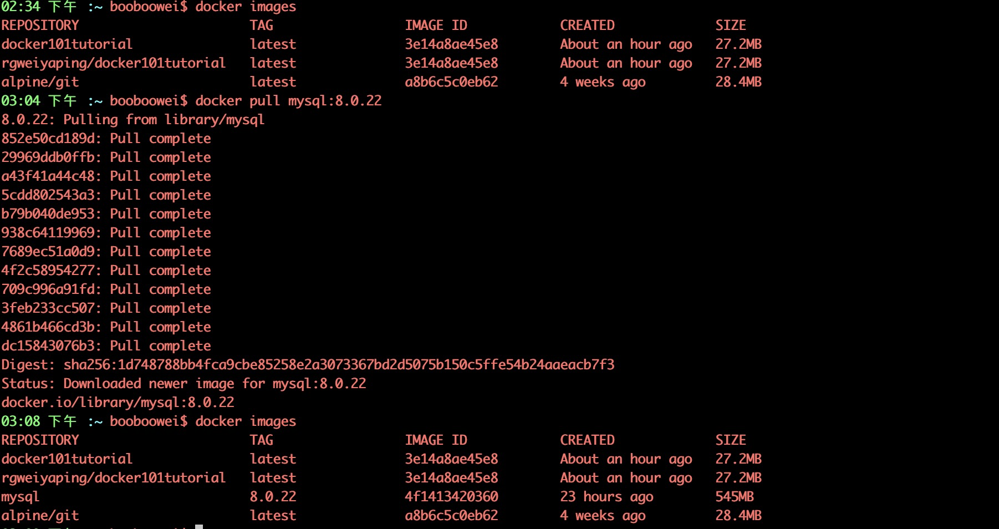

## 容器 mysql:8.0.22

1. 登陆 docker hub ，搜索mysql <https://hub.docker.com/_/mysql?tab=tags>
2. 拉到本地
3. 阅读帮助文档 <https://hub.docker.com/_/mysql?tab=description>
4. 初始化一个新实例
5. 阅读其他文档 <https://www.runoob.com/docker/docker-install-mysql.html>

```bash
# docker pull mysql:8.0.22
docker images

# mysql_node1

docker run -itd --name mysql_node1 -p 3306:3306 -e MYSQL_ROOT_PASSWORD=123456 -d mysql:8.0.22
# 参数说明：
## docker run 命令的参数
-d: 后台运行容器，并返回容器ID
-i: 以交互模式运行容器，通常与 -t 同时使用；
-name: 为容器命名
-v: "$`pwd`/data":/var/lib/mysql 将数据目录映射到宿主机的指定目录
-p: 指定端口映射,主机(宿主)端口:容器端口
## mysql 容器的参数
MYSQL_ROOT_PASSWORD=123456：设置 MySQL 服务 root 用户的密码。

## 查看日志
docker exec -it mysql_node1 bash
docker logs mysql_node1
## 进入容器使用mysql客户端连接数据库
docker exec -it mysql_node1 sh
mysql -uroot -p"$MYSQL_ROOT_PASSWORD"
create database booboo;
use booboo;
create table t1 (id int primary key ,num int);
insert into t1 values (1,100);
select * from t1;

## 逻辑备份
docker exec mysql_node1 sh -c 'exec mysqldump --all-databases -uroot -p"$MYSQL_ROOT_PASSWORD"' > `pwd`/all-databases.sql
## 停止容器
docker stop mysql_node1

# mysql_node2
## 导入备份
docker run -itd --name mysql_node2 -p 3306:3306 -e MYSQL_ROOT_PASSWORD=123456 -d mysql:8.0.22
docker exec -i mysql_node2 sh -c 'exec mysql -uroot -p"$MYSQL_ROOT_PASSWORD"' < `pwd`/all-databases.sql
## 交互式查询
docker exec -it mysql_node2 sh
mysql -uroot -p"$MYSQL_ROOT_PASSWORD"
select * from booboo.t1;
## 非交互式查询
docker exec mysql_node2 sh -c 'exec mysql -uroot -p"$MYSQL_ROOT_PASSWORD" -e "select * from booboo.t1"'
```



操作记录

```bash
05:35 下午 :~ booboowei$ docker run -itd --name mysql_node1 -p 3306:3306 -e MYSQL_ROOT_PASSWORD=123456 -d mysql:8.0.22
76478cf18dd80e02589b707232cfc7d96da1d59e7a30f7d441da42d3acde9971
05:35 下午 :~ booboowei$ docker image list
REPOSITORY          TAG                 IMAGE ID            CREATED             SIZE
mysql               8.0.22              4f1413420360        25 hours ago        545MB
05:35 下午 :~ booboowei$ docker ps --all
CONTAINER ID        IMAGE               COMMAND                  CREATED             STATUS              PORTS                               NAMES
76478cf18dd8        mysql:8.0.22        "docker-entrypoint.s…"   21 seconds ago      Up 20 seconds       0.0.0.0:3306->3306/tcp, 33060/tcp   mysql_node1
05:35 下午 :~ booboowei$ docker logs mysql_node1
2020-11-19 09:35:26+00:00 [Note] [Entrypoint]: Entrypoint script for MySQL Server 8.0.22-1debian10 started.
2020-11-19 09:35:26+00:00 [Note] [Entrypoint]: Switching to dedicated user 'mysql'
2020-11-19 09:35:26+00:00 [Note] [Entrypoint]: Entrypoint script for MySQL Server 8.0.22-1debian10 started.
2020-11-19 09:35:26+00:00 [Note] [Entrypoint]: Initializing database files
2020-11-19T09:35:26.378413Z 0 [System] [MY-013169] [Server] /usr/sbin/mysqld (mysqld 8.0.22) initializing of server in progress as process 45
2020-11-19T09:35:26.384963Z 1 [System] [MY-013576] [InnoDB] InnoDB initialization has started.
2020-11-19T09:35:26.801039Z 1 [System] [MY-013577] [InnoDB] InnoDB initialization has ended.
2020-11-19T09:35:28.049978Z 6 [Warning] [MY-010453] [Server] root@localhost is created with an empty password ! Please consider switching off the --initialize-insecure option.
2020-11-19 09:35:30+00:00 [Note] [Entrypoint]: Database files initialized
2020-11-19 09:35:30+00:00 [Note] [Entrypoint]: Starting temporary server
mysqld will log errors to /var/lib/mysql/76478cf18dd8.err
mysqld is running as pid 92
2020-11-19 09:35:31+00:00 [Note] [Entrypoint]: Temporary server started.
Warning: Unable to load '/usr/share/zoneinfo/iso3166.tab' as time zone. Skipping it.
Warning: Unable to load '/usr/share/zoneinfo/leap-seconds.list' as time zone. Skipping it.
Warning: Unable to load '/usr/share/zoneinfo/zone.tab' as time zone. Skipping it.
Warning: Unable to load '/usr/share/zoneinfo/zone1970.tab' as time zone. Skipping it.

2020-11-19 09:35:34+00:00 [Note] [Entrypoint]: Stopping temporary server
2020-11-19 09:35:36+00:00 [Note] [Entrypoint]: Temporary server stopped

2020-11-19 09:35:36+00:00 [Note] [Entrypoint]: MySQL init process done. Ready for start up.

2020-11-19T09:35:37.239688Z 0 [System] [MY-010116] [Server] /usr/sbin/mysqld (mysqld 8.0.22) starting as process 1
2020-11-19T09:35:37.249809Z 1 [System] [MY-013576] [InnoDB] InnoDB initialization has started.
2020-11-19T09:35:37.388270Z 1 [System] [MY-013577] [InnoDB] InnoDB initialization has ended.
2020-11-19T09:35:37.495677Z 0 [System] [MY-011323] [Server] X Plugin ready for connections. Bind-address: '::' port: 33060, socket: /var/run/mysqld/mysqlx.sock
2020-11-19T09:35:37.569246Z 0 [Warning] [MY-010068] [Server] CA certificate ca.pem is self signed.
2020-11-19T09:35:37.569759Z 0 [System] [MY-013602] [Server] Channel mysql_main configured to support TLS. Encrypted connections are now supported for this channel.
2020-11-19T09:35:37.572660Z 0 [Warning] [MY-011810] [Server] Insecure configuration for --pid-file: Location '/var/run/mysqld' in the path is accessible to all OS users. Consider choosing a different directory.
2020-11-19T09:35:37.595682Z 0 [System] [MY-010931] [Server] /usr/sbin/mysqld: ready for connections. Version: '8.0.22'  socket: '/var/run/mysqld/mysqld.sock'  port: 3306  MySQL Community Server - GPL.

05:38 下午 :~ booboowei$ docker exec -it 76478cf18dd8 sh
# ls
bin  boot  dev    docker-entrypoint-initdb.d  entrypoint.sh  etc    home  lib  lib64  media  mnt  opt  proc  root  run  sbin  srv  sys  tmp  usr  var
# which mysql
/usr/bin/mysql
# mysql
ERROR 1045 (28000): Access denied for user 'root'@'localhost' (using password: NO)
# mysql -uroot -p"$MYSQL_ROOT_PASSWORD"
mysql: [Warning] Using a password on the command line interface can be insecure.
Welcome to the MySQL monitor.  Commands end with ; or \g.
Your MySQL connection id is 12
Server version: 8.0.22 MySQL Community Server - GPL

Copyright (c) 2000, 2020, Oracle and/or its affiliates. All rights reserved.

Oracle is a registered trademark of Oracle Corporation and/or its
affiliates. Other names may be trademarks of their respective
owners.

Type 'help;' or '\h' for help. Type '\c' to clear the current input statement.

mysql> show databases;
+--------------------+
| Database           |
+--------------------+
| information_schema |
| mysql              |
| performance_schema |
| sys                |
+--------------------+
4 rows in set (0.01 sec)
mysql> create database booboo;
Query OK, 1 row affected (0.01 sec)

mysql> use booboo;
Database changed
mysql> create table t1 (id int primary key ,num int);
Query OK, 0 rows affected (0.02 sec)

mysql> insert into t1 values (1,100);
Query OK, 1 row affected (0.01 sec)

mysql> select * from t1;
+----+------+
| id | num  |
+----+------+
|  1 |  100 |
+----+------+
1 row in set (0.00 sec)

05:43 下午 :~ booboowei$ docker exec mysql_node1 sh -c 'exec mysqldump --all-databases -uroot -p"$MYSQL_ROOT_PASSWORD"' > `pwd`/all-databases.sql
05:43 下午 :~ booboowei$ ll all-databases.sql
-rw-r--r--  1 booboowei  staff   3.6M 11 19 17:42 all-databases.sql

5:44 下午 :~ booboowei$ docker run -itd --name mysql_node2 -p 3306:3306 -e MYSQL_ROOT_PASSWORD=123456 -d mysql:8.0.22
e54f1bc29d33984dac3303c26f332618d26785043ecf9cf76e088224c3797c14
05:45 下午 :~ booboowei$ docker exec -i mysql_node2 sh -c 'exec mysql -uroot -p"$MYSQL_ROOT_PASSWORD"' < `pwd`/all-databases.sql
mysql: [Warning] Using a password on the command line interface can be insecure.

05:47 下午 :~ booboowei$ docker exec mysql_node2 sh -c 'exec mysql -uroot -p"$MYSQL_ROOT_PASSWORD" -e "select * from booboo.t1"'
mysql: [Warning] Using a password on the command line interface can be insecure.
id    num
1    100
```
