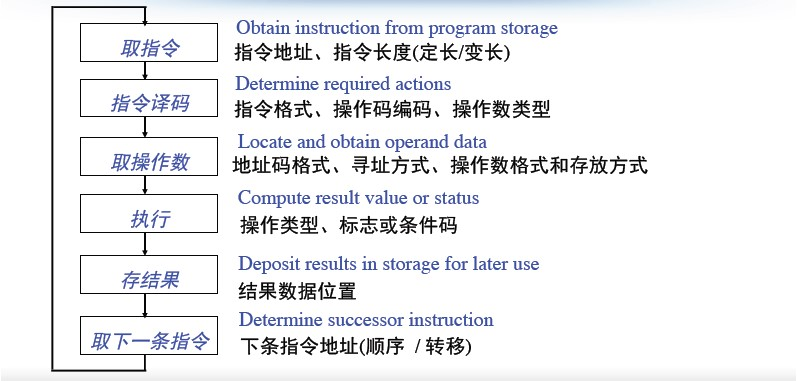
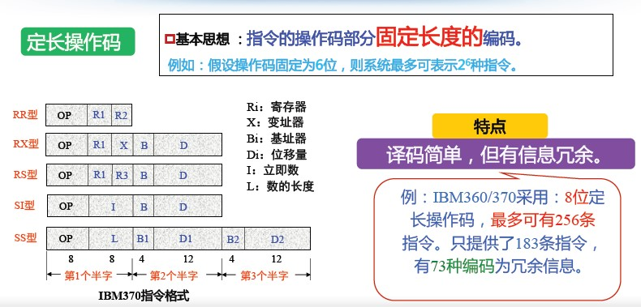
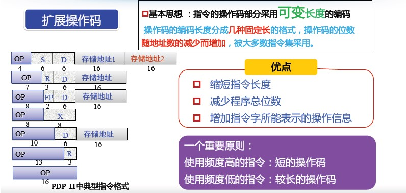
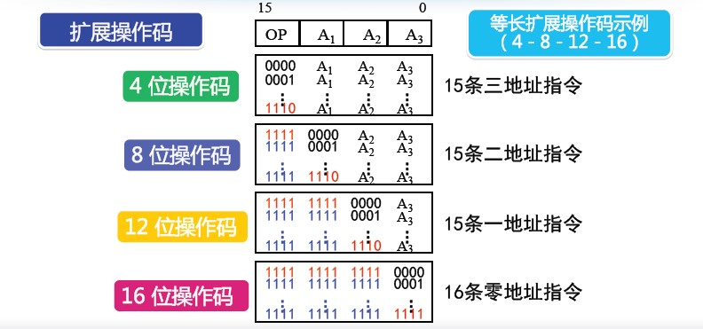

## 指令系统概述

理解计算机语言，首先要学习的是 **指令** 和 **指令系统** 这两个概念。

然后是指令系统的两种类型 **CISC** 与 **RISC**，以及他们的优缺点。


指令：计算机实现某个基本操作的命令
指令系统：一台计算机的所有指令。计算机硬件和软件的接口及界面




| 设计原则 | 特点                         |
| -------- | ---------------------------- |
| 完备性   | 该有的都要有                 |
| 有效性   | 简洁、加速常用操作、没有歧义 |
| 规整性   | 对称、匀齐、一致             |
| 兼容性   | 之前/之后的都要能用          |


兼容性：
* 向上（下）兼容：按某档机器编制的程序，不加修改的就能运行于比它高（低）档的机器
* 向前（后）兼容：按某个时期投入市场的某种型号机器编制的程序，不加修改就能运行于在它之前(后)投入市场的机器


| 指令 | 说明                         |
| -------- | ---------------------------- |
| 数据传送指令   | Load/Save指令                 |
| 输入输出指令   | In/Out指令 |
| 算术运算指令   | Add等指令            |
| 逻辑运算指令   | And等指令          |
| 系统控制指令   | 中断等指令          |
| 程序控制指令   | Jump等指令          |


### CISC与RISC




| 名称 | 定义                                                  | 特点                                                         | 缺陷                                                         |
| ---- | ----------------------------------------------------- | ------------------------------------------------------------ | ------------------------------------------------------------ |
| CISC | 复杂指令集计算机<br/>Complex Instruction Set Computer | (1) 指令系统复杂<br/>(2) 指令周期长<br/>(3) 各种指令都能访问存储器<br/>(4) 有专用寄存器<br/>(5) 采用微程序控制<br/>(6) 难以进行编译优化生成高效目标代码 | (1) 指令系统复杂<br/>(2) 各种指令都能访问存储器<br/>(3) 指令周期长<br/>(4) 有专用寄存器<br/>(5) 采用微程序控制<br/>(6) 难以进行编译优化生成高效目标代码 |
| RISC | 精简指令集计算机<br/>Reduce Instruction Set Computer  | (1) 简化的指令系统<br/>(2) 以寄存器-寄存器方式工作<br/>(3) 指令周期短<br/>(4) 采用大量通用寄存器，以减少访存次数<br/>(5) 采用组合逻辑电路控制，不用或少用微程序控制<br/>(6) 采用优化的编译系统，力求有效地支持高级语言程序 | 小而精                                                       |


例：第一代RISC机
* 加州伯克利大学的RISCⅠ
* 斯坦福大学的MIPS
* IBM公司的IBM801


* 现代处理器大多采用RISC体系结构
• Intel x86为“兼容”需要，保留CISC风格，同时借鉴了RISC思想



## 指令格式


指令是指挥计算机实现某个基本操作的命令


指令执行过程





| 指令设计       | 设计原则 | 描述                                                         |
| -------------- | -------- | ------------------------------------------------------------ |
| 指令长度的设计 | 规整性   | * 一条指令包含1个操作码和多个地址码<br/>* 取决于操作码长度、操作数地址长度和地址个数。<br/><br/>定长指令字：所有指令的长度相同。需向最长指令看齐<br/>变长指令字：不同指令的长度不同 |
| 操作码设计     | 有效性   | 每条指令的操作码：只能是一个。<br/>用一定长度的不同编码表示不同的操。 |
| 操作码设计     | 完备性   | 操作码的编码方式决定操作码的长度<br/>* 定长操作码法<br/>* 变长/扩展操作码法<br/>操作码长度和指令长度的关系<br/>* 指令长度是否可变与操作码长度是否可变没有绝对联系<br/>* 关注程序代码长度时：变长指令字、变长操作码<br/>* 关注性能时：定长指令字、定长操作码 |
| 地址码设计   |          | 地址码个数与性能和实现难度密切相关                           |

### 操作码设计

> 长度设计 

| 名称              | 基本思想                                                     | 特点                                                         |
| ----------------- | ------------------------------------------------------------ | ------------------------------------------------------------ |
| 定长操作码法      | 指令的操作码部分固定长度的编码                               | 译码简单，但有信息冗余。                                     |
| 变长/扩展操作码法 | 指令的操作码部分采用可变长度的编码。<br/>操作码的编码长度分成几种固定长的格式，<br/>操作码的位数随地址数的减少而增加，被大多数指令集采用。 | 1.缩短指令长度<br/>2.减少程序总位数<br/>3.增加指令字所能表示的操作信息<br/>一个重要原则：<br/>使用频度高的指令：短的操作码<br/>使用频度低的指令：较长的操作码 |

*指令长度是否可变与操作码长度是否可变没有绝对联系*









例：某指令系统指令字长16位，每个地址码为6位。若二地址指令15条，一地址指令34条，则剩下零地址指令最多有多少条？



### 地址码结构


个数：0到多个，看操作码的需要了。地址码个数与性能和实现难度密切相关。

个数多少特点：

```
地址个数越少,指令长度越短,指令功能越简单
地址个数越少,所需指令条数越多,增加了程序复杂度和执行时间
#需要在硬件设计的简洁性和程序的复杂性中做权衡
```

分类

```shell
#零地址指令
(1) 无需操作数。如：空操作／停机等
(2) 所需操作数为默认的。如：堆栈等
#一地址指令
其地址既是源操作数地址，也是存放结果地址
(1) 单目运算：如：取反／取负等
(2) 双目运算：另一操作数为默认的　如：累加器等
#二地址指令(最常用)
分别存放双目运算中两个源操作数地址，并将其中一个地址作为存放结果地址
#三地址指令(RISC风格)
分别为双目运算中两个源操作数地址和一个结果地址
#多地址指令
用于成批数据处理的指令，如：向量指令 等
```


## 指令的寻址方式

寻址方式：就是如何找到操作数存放位置的方法

使用目的

```
* 扩大访存范围
* 提高访问数据的灵活性和有效性
* 支持软件技术的发展：多道程序设计
```

址方式的概念

| 分类       | 难度 | 方式                                                         |
| ---------- | ---- | ------------------------------------------------------------ |
| 指令寻址   | 简单 | 正常：PC增值<br/>跳转 ( jump / branch / call / return )，同操作数的寻址 |
| 操作数寻址 | 复杂 | 操作数的来源：寄存器 / 外设端口 / 主(虚)<br/>存 / 栈顶<br/>操作数的数据结构：位 / 字节 / 半字 / 字 /<br/>双字 / 一维表 /… |

基本寻址方式

| 分类           | 定义                                                         | 特点                                                         |
| -------------- | ------------------------------------------------------------ | ------------------------------------------------------------ |
| 立即数寻址     | Ø 指令地址字段直接给出操作数本身<br/>Ø 立即数寻址只能作为双操作数指令的源操作数 | 1.指令执行时间很短，<br/>无需访存<br/>2.操作数的大小受地址<br/>字段长度的限制<br/>3.广泛使用 |
| 存储器直接寻址 | 操作数在存储器中，指令地址字段<br/>直接给出操作数在存储器中的地址 | 1.处理简单、直接<br/>2.寻址空间受到指令的地址字段长度限制<br/>3.较少使用，8位计算机和一些16位计算机 |
| 寄存器直接寻址 | 操作数在通用寄存器中，指令地址字段<br/>直接给出存放操作数的寄存器编号 | 1. 只需要很短的地址字段<br/>2. 无需访存，指令执行速度快<br/>3. 地址范围有限，可以编程使用的通用寄存器不多<br/>4. 使用最多，是提高性能的常用手段 |
| 存储器间接寻址 | • 操作数和操作数地址都在存储器中<br/>• 指令地址字段直接给出"操作数地址"在存储器中的地址 | Ø 寻址空间大，灵活，便于编程<br/>Ø 至少需要两次访存才能取到操作数<br/>Ø 执行速度慢 |
| 寄存器间接寻址 | • 操作数在存储器中<br/>• 操作数地址在寄存器中<br/>• 指令地址字段给出的寄存器的内容是操作数在存储器中的地址 | Ø 比存储器间接寻址少访问<br/>存储器一次<br/>Ø 寻址空间大，使用比较普遍 |
| 偏移寻址       | 直接寻址+寄存器间接寻址<br/>1 相对寻址： EA=(PC)+A<br/>相对于当前指令处 位移量为A的单元<br/>2 基址寻址： EA=(B)+A<br/>相对于基址(B)处 位移量为A的单元<br/>3 变址寻址： EA=(I)+A<br/>相对于形式地址A处位移量为(I)的单元 |                                                              |
| 堆栈寻址       | Ø 堆栈的结构：一段内存区域<br/>Ø 栈底、栈顶<br/>Ø 堆栈指针(SP)：一个特殊寄存器，指向栈顶<br/>PUSH ( 从寄存器到堆栈)<br/>POP (从堆栈到寄存器) |                                                              |


## 数据表示方式
### 数值定点表示
### 数值浮点表示
### 数值十进制表示
### 字符机器表示
### 数据的度量与存储
### 数据出错
### 基本指令和指令类别


